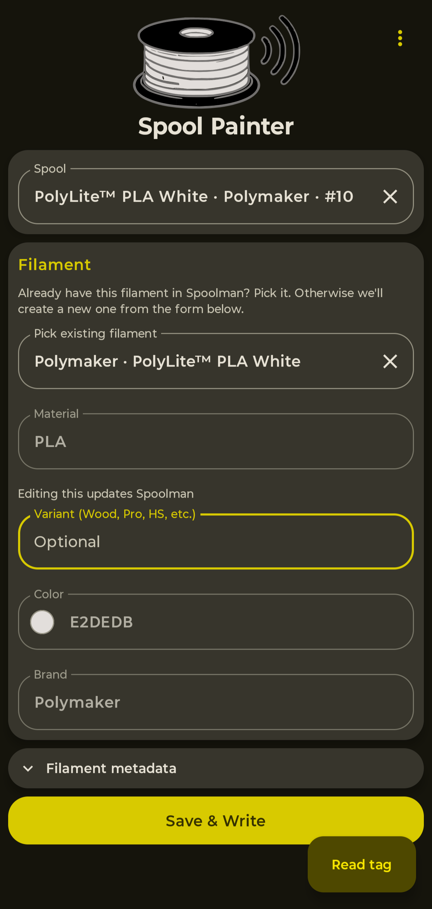
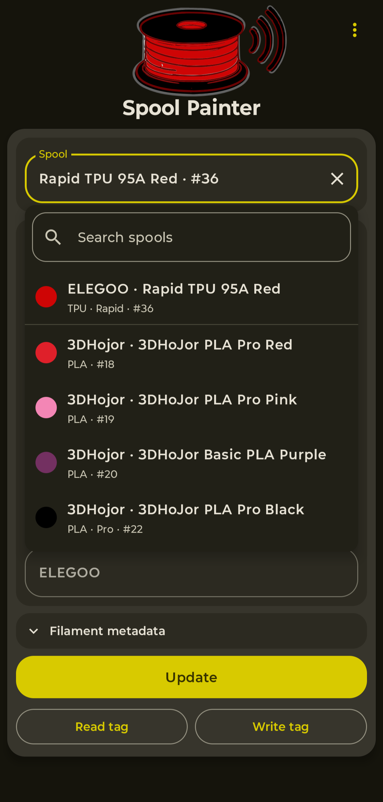
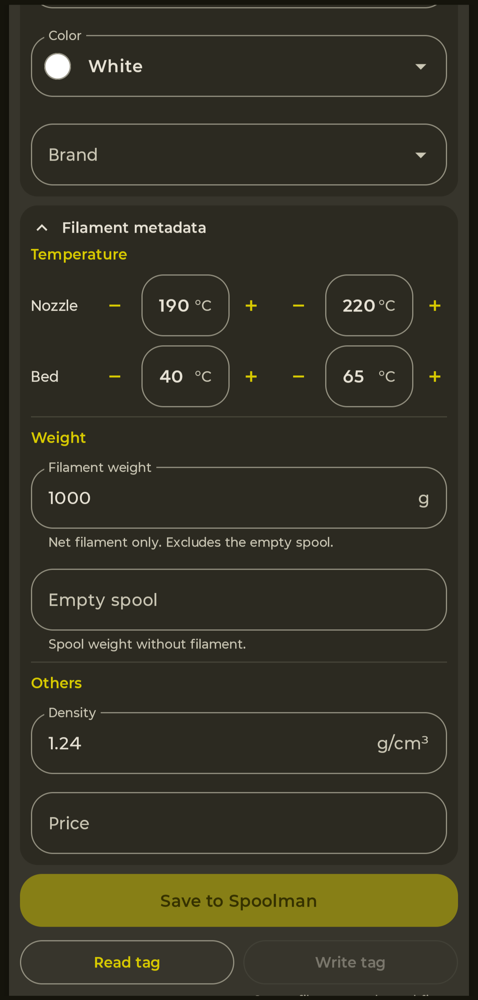
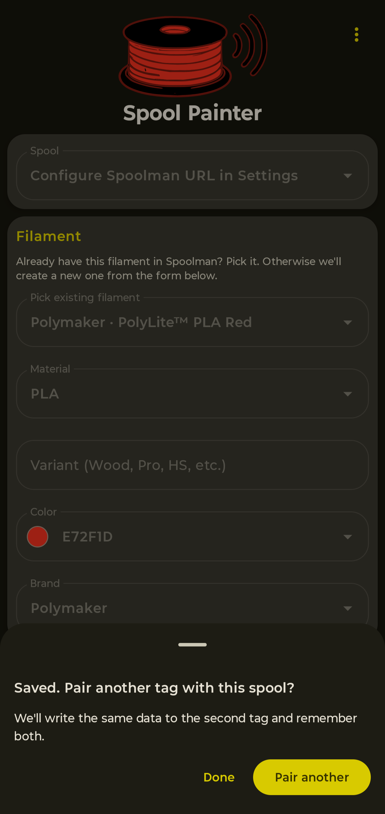
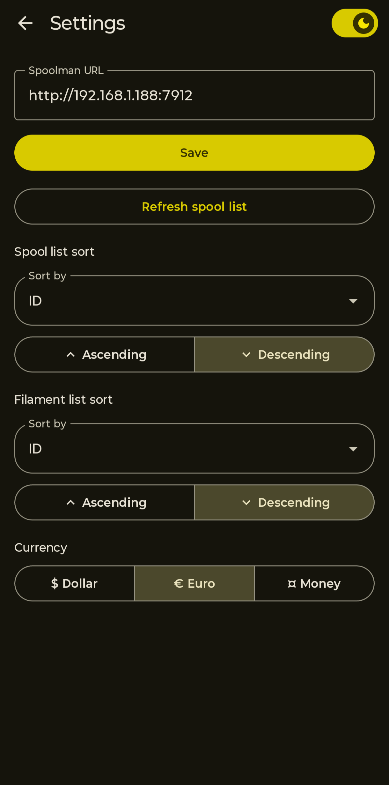
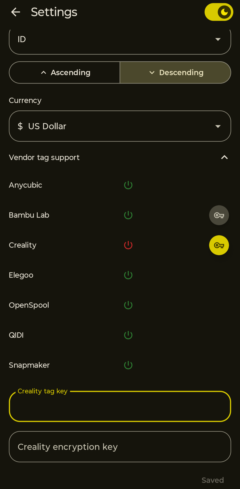
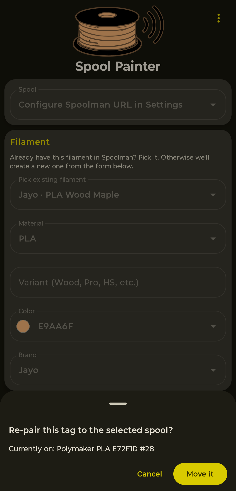
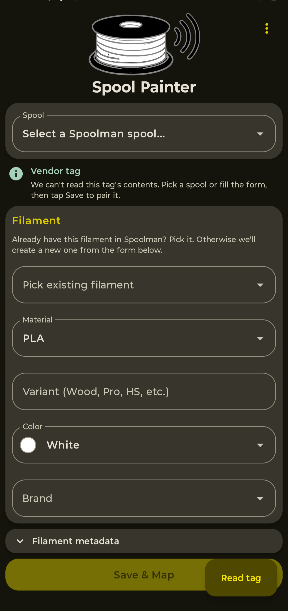
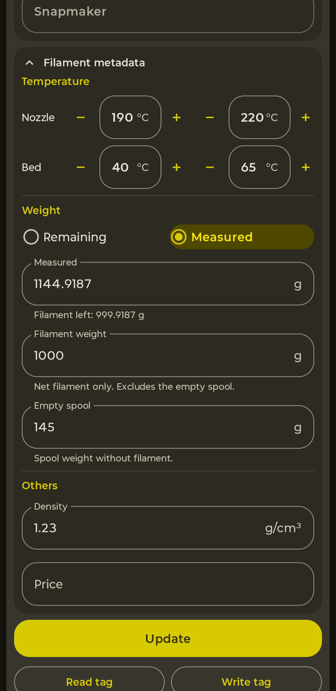
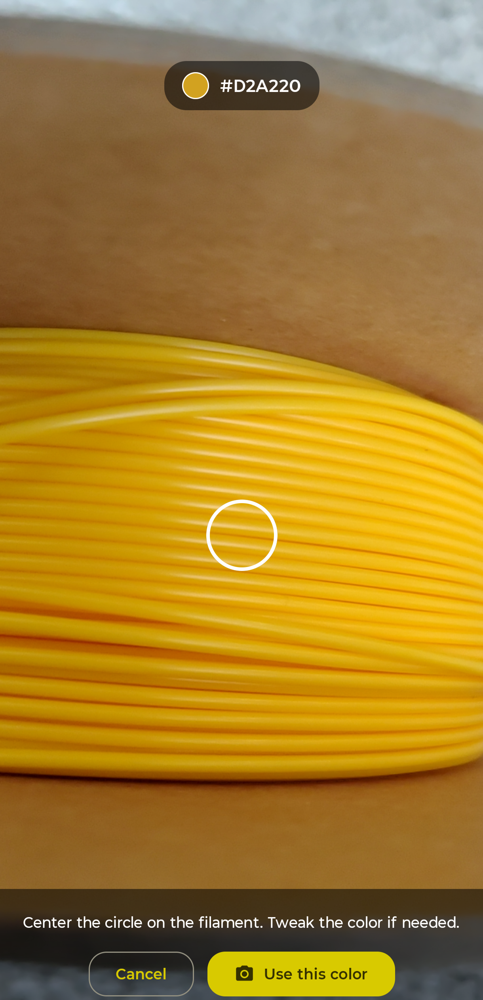

# SpoolPainter


Android app for managing 3D printer filament spools via NFC tags. Reads / writes filament metadata in [OpenSpool](https://openspool.io/) format and syncs with a self-hosted [Spoolman](https://github.com/Donkie/Spoolman) inventory.

`v2.2` · `applicationId` `com.spoolpainter.app` · `minSdk 29` (Android 10+) · `targetSdk 36`

### [Get it on Google Play](https://play.google.com/store/apps/details?id=com.spoolpainter.app)

The latest build is rolling out on **Open testing** first. [Join the testing program](https://play.google.com/apps/testing/com.spoolpainter.app) to try new features a few days before they hit the stable track.

## What it is

SpoolPainter is for 3D printing hobbyists who:

- run a Spoolman server on their LAN to track filament inventory, and
- want OpenSpool-compatible NFC tags stuck on their spools so other tools (printer firmware, scripts) can read material / brand / colour / temperatures off the tag.

It is a single-user, sideloadable Android app. No accounts, no cloud, no analytics. The Spoolman URL you configure is the only network destination the app talks to.

## Screenshots

| Main screen | Spool dropdown | Form + filament metadata |
|---|---|---|
|  |  |  |

| Pair another tag | Settings | Vendor key field |
|---|---|---|
|  |  |  |

| Move-on-bind | Vendor tag chip | Vendor tag prefilled |
|---|---|---|
|  |  |  |

| Weight: Remaining / Measured | Scan color with the camera |
|---|---|
|  |  |

## What's new in v2.2

- **Scan a color with the camera.** In the Color picker, tap **Scan color** to open a live camera view with a center reticle and a live hex readout. Point it at a spool and the app samples the color under the reticle into the Color field. It's an approximate starting point you can fine-tune in the Color Wheel, not an exact match (lighting and white balance shift raw camera pixels). Adds the `CAMERA` permission; the camera is optional (the feature is a convenience, NFC stays the core).

## What's new in v2.1

- **Vendor tag read — six brands.** Bambu Lab, Snapmaker, QIDI, Anycubic, Elegoo, and Creality tags decode and prefill the form just like OpenSpool tags. Snapmaker / QIDI / Anycubic / Elegoo work out of the box. Bambu Lab and Creality need a one-time per-brand setup in Settings → **Vendor tag support**, which lists every supported brand with a status glyph showing whether SpoolPainter can read it. Pairing runs the standard Map-tag flow (UID-only, no write back to the chip). QIDI / Anycubic / Elegoo / Creality decode logic is ported from [OpenRFID](https://github.com/suchmememanyskill/OpenRFID) under GPL-3.0; see NOTICE for the upstream commit pin.
- **Tester feedback for tag reads.** Settings → **Report a tag issue** opens a short report form with the most recent NFC scan (chip type, UID, parse outcome — no personal data) pre-filled, so you can tell us about a vendor tag we don't yet support without retyping anything.
- **Save and Write are separate buttons.** Save commits the form to Spoolman (no NFC). Write does the tag pairing in a second tap. Either button flips to a full-width Cancel during its own tag-waiting flow.
- **Radio weight picker.** Remaining and Measured are now mutually-exclusive options on a segmented row. The active method's input field renders below; the inactive one is hidden. No more silent keystroke loss when the form was missing an empty-spool weight.
- **Edit more on existing spools.** Color, density, filament weight, temperatures, and per-spool price are now editable on the existing-spool path; Save patches the underlying filament record. Material and brand stay locked (changing those means you picked the wrong filament — pick a different one instead).
- **22-currency dropdown** in Settings (was 3 segmented options).

## What v2.0 does

- **Read NFC tags** — tap a tag to read the OpenSpool payload and prefill the form. Tags that are not OpenSpool (vendor or non-NDEF) are surfaced as such, not silently rejected. A vendor-tag chip appears with action-oriented copy ("Pick a spool or fill the form, then tap Save to pair it") instead of an opaque error.
- **NFC status pills** — a status affordance at the top of the screen surfaces "Reading…" / "Writing…" so you always know what state the tap is in.
- **Create-and-pair** — fill the form, tap a blank tag; the app creates the filament + spool in Spoolman (with `extra.variant` and `extra.card_uids` populated) and writes the OpenSpool payload to the tag in one motion.
- **Pair another tag** — after the first write, a sheet prompts you to tap a second tag for the same spool. Both UIDs land on the same Spoolman spool, so a printer reading either side of a two-sided spool gets the same answer.
- **Move-on-bind** — if you tap a tag that's already paired with a different spool, the app asks before moving the binding. Confirming sweeps the UID off the source spool(s) and appends it to the target.
- **Side modes** — Raw write (write a payload to a blank tag without binding to Spoolman) and Vendor UID-only pair (bind a vendor / non-NDEF tag's UID to a spool without writing a payload).
- **Pickers + filament metadata** — material / variant / colour / brand pickers with custom-entry support (the "Other" affordance feels like an action, not a checkbox option), plus a "Filament metadata" expander for filament weight, empty spool weight, density, and price. Diameter defaults to 1.75mm at create — no UI surface (edit non-1.75mm filaments via Spoolman web). Variant lives on the main form because it also rides the tag write.
- **Edit a paired spool** — pick a spool from the dropdown, edit weight + metadata, tap Save (and Write to push to the tag if needed). The spool / filament records get PATCHed in Spoolman; the **stale-prefill guard** ensures opening an aged form and saving without edits never overwrites Spoolman's fresher value (printer firmware decrements remaining_weight in the background). Legacy v1 tags whose `subtype` was never written back get promoted into `extra.variant` on the next Write.
- **Per-spool price + empty-spool override** — Spoolman supports both at the spool record level (overriding the filament default per `COALESCE(spool.price, filament.price)` semantics). Editable when creating a new spool; the existing-spool path also unlocks price as a per-spool override (v2.1).
- **Auto-cleanup of orphan records** — if a Save & Write fails partway through (NFC timeout, tag pulled too early, write failure), any spool / filament / vendor records the app created in Spoolman before the failure are best-effort cleaned up so your inventory doesn't accumulate orphans.
- **Settings**
  - Spoolman URL — Save runs a connectivity probe
  - Independent sort orders for the spool dropdown (Material / Brand / ID / Last Used) and the filament picker (Material / Brand / ID), each with Asc/Desc segmented controls
  - Theme toggle (Light / Dark) on the Settings top app bar
  - Currency for the price field — 22-entry dropdown
  - **Vendor tag support** (collapsed by default) — list of supported brands with a status glyph; per-brand setup tucked behind a small button on the right of the row
- **Spoolman gating** — the Spoolman-dependent form sections hide entirely when no URL is configured, and disable (still visible) when the URL is configured but the server is unreachable. The temperature section stays usable in all states because temps live on the tag, not in Spoolman.
- **Keyboard-aware UI** — snackbar messages slide above the IME keyboard so confirmations and errors aren't hidden mid-edit.
- **In-place v1 → v2 update** — same package id (`com.spoolpainter.app`). v2 installs over v1; no data migration is needed because data lives on tags + Spoolman, not in the app.

## How to install

### From the Play Store

v2 is live on Google Play.

[Get it on Google Play](https://play.google.com/store/apps/details?id=com.spoolpainter.app)

Install it like any other app; updates arrive automatically as new releases land.

New releases go out on **Open testing** for a few days before the stable track. [Join the testing program](https://play.google.com/apps/testing/com.spoolpainter.app) to opt in and get them early.

### Build from source

Requires JDK 17 (`JAVA_HOME` must point to a JDK 17 install). Android Studio Iguana or newer recommended; the Gradle wrapper handles everything else.

```bash
git clone https://github.com/ni4223/SpoolPainter.git
cd SpoolPainter

# Debug build — installs as com.spoolpainter.app.debug, can coexist with v1
./gradlew :app:installDebug
```

For release builds (signed APK / AAB), you also need a local keystore at `~/spoolpainter-release-key.jks` and one of:
- the `KEYSTORE_PASSWORD` env var, or
- `~/spoolpainter-keystore.pwd` containing the password.

```bash
./gradlew :app:assembleRelease   # signed APK
./gradlew :app:bundleRelease     # signed AAB
```

## How to use

1. Install the app and grant the NFC permission on first launch.
2. (Optional but expected for full functionality) Open Settings, paste your Spoolman URL (`http://<host>:7912`), tap Save. The Spoolman-dependent UI unlocks once the connectivity probe succeeds.
3. **To read a tag**: tap any tag with the app open — the UID surfaces in the form. If the tag has an OpenSpool payload, the form prefills.
4. **To pair a new spool**: fill the form, tap a blank tag. The filament + spool are created in Spoolman, the payload is written to the tag, and the sheet asks if you want to pair a second tag with the same spool.
5. **To pair a second tag with an existing spool**: pick the spool from the dropdown and tap a blank tag. Or tap a tag that's already paired with a different spool — the app will ask before moving the binding.

## NFC compatibility

- **Tag types**: NDEF-formattable tags. NTAG215 / NTAG216 give the most headroom; NTAG213 works but is tighter.
- **Vendor / non-NDEF tags**: read-only support since v2.1. Six brands supported (Bambu Lab, Snapmaker, QIDI, Anycubic, Elegoo, Creality). Snapmaker / QIDI / Anycubic / Elegoo work out of the box; Bambu Lab and Creality need a one-time per-brand setup in Settings → Vendor tag support. Decoded tags prefill the form; pairing then runs the standard UID-only "Map tag" flow (no write back to a vendor chip — those chips can't accept one). Decoding only runs on an explicit Read tap, not on passive ambient taps.

## Privacy

- Single-user app. No login, no account.
- No analytics, no telemetry, no crash reporting.
- The Spoolman URL you configure in Settings is the only network destination. The app uses HTTP (cleartext) by default because Spoolman is typically self-hosted on a LAN.
- Tag data is read / written directly between the phone and the NFC tag — nothing else sees it.

## What's coming next (planned)

- **Type-to-search the spool and filament pickers.** Start typing to filter the dropdown by material / brand / name instead of scrolling a long list.
- **Closest-match suggestion on tag read.** When a tag is read but not already paired, suggest the closest-matching spool or filament in your Spoolman inventory (by material / brand / colour / temperatures) so you can confirm a link in one tap instead of hunting for it.
- Re-pair flow for changing a spool's material / brand after pairing (today material + brand are locked on existing-spool because changing them means "wrong filament picked"; a re-pair flow lets you switch to a different filament cleanly).
- Archive a spool / filament from the app (today archiving requires the Spoolman web UI).

## Tech stack (developer notes)

- Kotlin (JVM target 11), `compileSdk 36`, `targetSdk 36`, `minSdk 29`
- Jetpack Compose + Material 3, single-Activity Compose-only screens
- Hilt DI + KSP
- Retrofit + Gson + OkHttp logging interceptor (Spoolman API client)
- kotlinx-serialization JSON over DataStore (Settings)
- Native Android NFC API (NDEF; no third-party NFC lib)
- R8 minify + resource shrinking on release; debug builds keep verbose logs

The release build is ~7 MB after R8; debug is ~64 MB.

## Architecture (developer notes)

Single-Activity Compose-only MVVM with `MainViewModel` orchestrating five use-cases (`ReadAndPairUseCase`, `CreateAndPairUseCase`, `TwoTagUseCase`, `RawWriteUseCase`, `VendorUidOnlyPairUseCase`) plus a `MoveOnBindConfirmer` for cross-spool repair flows. Layers:

- `ui/` — Compose screens + components
- `domain/` — use-cases, primitives (`CardUid`, `TagClassification`, `OpenSpoolPayload`), domain models
- `data/local/` — Settings DataStore, material / brand presets
- `data/remote/spoolman/` — Retrofit + repository
- `hardware/nfc/` — `NfcRepository`, `NfcAdapterWrapper`, intent-arming + tag classification

Component diagram: `aidlc-docs/inception/application-design/application-design-component-diagram.png`.

This repo follows the AIDLC (AI Development Lifecycle) workflow under `aidlc-docs/`. For project-internal context — how the codebase is structured, how features are designed and shipped per unit — start with [`CLAUDE.md`](CLAUDE.md).

## Contributing

Bug reports and testing feedback welcome — open a GitHub issue. PRs against the `main` branch are welcome.

## License

GPL-3.0 — see [LICENSE](LICENSE) for the full text and [NOTICE](NOTICE)
for third-party attribution.

## Acknowledgements

[Spoolman](https://github.com/Donkie/Spoolman) by Donkie — the inventory backend SpoolPainter syncs with.
