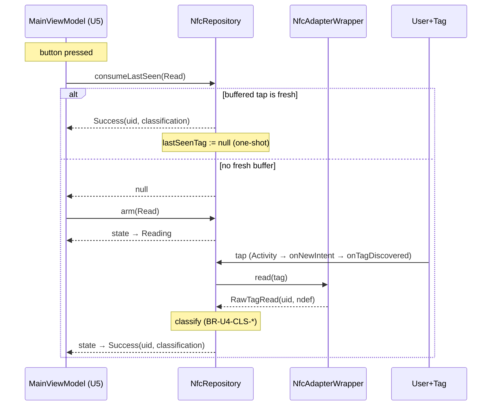
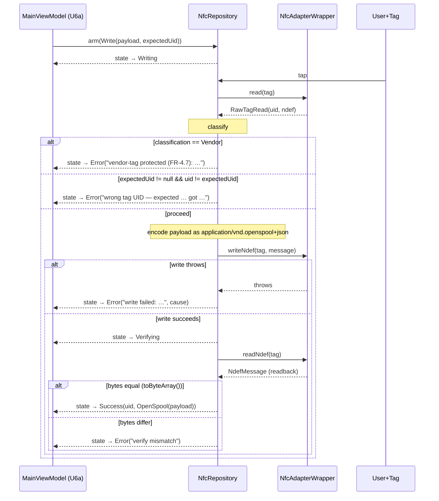
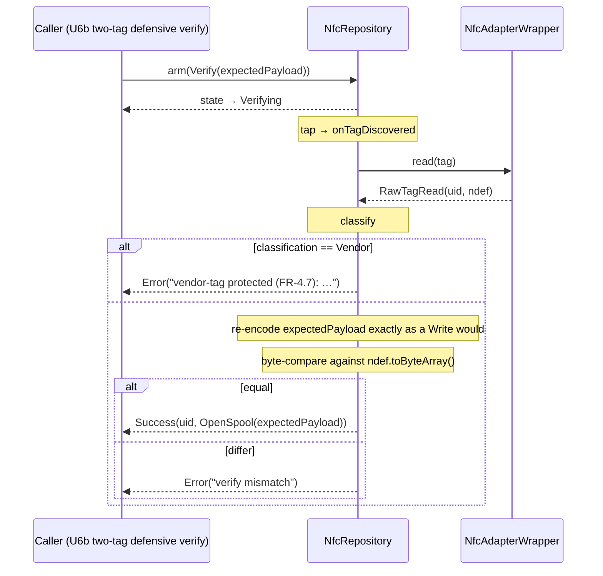

# U4 — Business Logic Model

**Stage**: CONSTRUCTION → Functional Design (U4)
**Companion**: `domain-entities.md`, `business-rules.md`

---

## 1. Component shape

```
┌──────────────────────────────────────────────────────────────────┐
│                         NfcRepository (@Singleton)               │
│                                                                  │
│  state: StateFlow<NfcResult>     lastSeenTag: StateFlow<TagBuffer?>
│                                                                  │
│  attach(activity)        ── ▶  enableForegroundDispatch
│  detach()                ── ▶  disableForegroundDispatch
│  arm(intent)             ── ▶  state := Reading|Writing|Verifying
│  consumeLastSeen(intent) ── ▶  one-shot read against buffer
│  disarm()                ── ▶  state := Idle
│  onTagDiscovered(tag)    ── ▶  branch on state + intent           │
│                                                                  │
└──────────────────────────────┬───────────────────────────────────┘
                               │ depends on
                               ▼
                ┌─────────────────────────────────┐
                │   NfcAdapterWrapper             │
                │                                 │
                │  isAvailable()                  │
                │  enableForegroundDispatch(a)    │
                │  disableForegroundDispatch(a)   │
                │  read(tag): RawTagRead          │
                │  writeNdef(tag, msg)            │
                │  readNdef(tag): NdefMessage?    │
                └────────────────┬────────────────┘
                                 │
                                 ▼
                ┌─────────────────────────────────┐
                │  android.nfc.NfcAdapter / Tag   │
                │  android.nfc.tech.Ndef          │
                └─────────────────────────────────┘
```

Reads are off-main thread inside the wrapper (`withContext(Dispatchers.IO)`).
The repository's public methods are `suspend` and main-safe per the
component-methods.md convention.

---

## 2. State machine

### 2.1 State table

| State | Description | Terminal? |
|---|---|---|
| `Idle` | No armed intent. Buffered taps still update `lastSeenTag`. | yes |
| `Reading` | `arm(Read)` was called; awaiting next tap. | no |
| `Writing` | `arm(Write)` was called; awaiting next tap; will write + verify on tap. | no |
| `Verifying` | Either inside the write-then-verify protocol after a successful write, OR `arm(Verify)` was called and is awaiting tap. | no |
| `Success(uid, classification)` | Last operation succeeded. `disarm()` returns to `Idle`; new `arm(...)` also clears. | yes |
| `Error(reason, cause?)` | Last operation failed. Same clearing semantics as `Success`. | yes |

### 2.2 Transition matrix

(See `business-rules.md` BR-U4-SM-* for the authoritative ruleset. The
table here is a visual restatement.)

```
                       arm(Read)   arm(Write)  arm(Verify)  disarm   onTag (idle/term)   onTag (Reading)   onTag (Writing)        onTag (Verifying)
Idle              ──▶  Reading  │  Writing   │  Verifying  │ Idle  │  Idle (buf only) │  ─               │  ─                   │  ─
Reading           ──▶  Reading  │  Writing   │  Verifying  │ Idle  │  ─               │  Success/Error   │  ─                   │  ─
Writing           ──▶  Reading  │  Writing   │  Verifying  │ Idle  │  ─               │  ─               │  Verifying→S/E       │  ─
Verifying         ──▶  Reading  │  Writing   │  Verifying  │ Idle  │  ─               │  ─               │  ─                   │  Success/Error
Success(_,_)      ──▶  Reading  │  Writing   │  Verifying  │ Idle  │  Success (buf)   │  ─               │  ─                   │  ─
Error(_,_)        ──▶  Reading  │  Writing   │  Verifying  │ Idle  │  Error (buf)     │  ─               │  ─                   │  ─
```

Notes:
- "buf only" / "buf" = `lastSeenTag` is updated but `state` is unchanged.
- Re-armed transitions (e.g. `Reading` → `Writing`) implicitly call `disarm` first.
- Reentrant taps during `Writing | Verifying` are dropped (BR-U4-SM-13).

---

## 3. Read flow (Q-U4-3=A: tag-first via `consumeLastSeen`, button-first via `arm`)



---

## 4. Write-then-verify flow (FR-4.4 / FR-4.5 / NFR-6)



---

## 5. Standalone `Verify` flow (Q-U4-7=A)



---

## 6. Hilt wiring

`NfcModule` providers (object Module, `@InstallIn(SingletonComponent::class)`):

```kotlin
@Provides @Singleton
fun provideNfcAdapter(@ApplicationContext ctx: Context): NfcAdapter? =
    NfcAdapter.getDefaultAdapter(ctx)

@Provides @Singleton
fun provideNfcAdapterWrapper(
    adapter: NfcAdapter?,
    @IoDispatcher dispatcher: CoroutineDispatcher,
): NfcAdapterWrapper = NfcAdapterWrapper(adapter, dispatcher)

@Provides @Singleton
fun provideClock(): Clock = Clock.System // kotlinx.datetime.Clock
```

`NfcRepository` is `@Inject`-constructor:

```kotlin
@Singleton
class NfcRepository @Inject constructor(
    private val wrapper: NfcAdapterWrapper,
    @AppScope private val scope: CoroutineScope,
    @IoDispatcher private val ioDispatcher: CoroutineDispatcher,
    private val clock: Clock,
    private val ttlMs: Long = TTL_MS_DEFAULT, // BR-U4-TTL-2
)
```

`@AppScope` and `@IoDispatcher` qualifiers already exist in
`Qualifiers.kt` from U1/U3 — no new qualifier types in U4.

---

## 7. `MainActivity` integration

```kotlin
@AndroidEntryPoint
class MainActivity : ComponentActivity() {

    @Inject lateinit var nfcRepository: NfcRepository

    override fun onCreate(savedInstanceState: Bundle?) {
        super.onCreate(savedInstanceState)
        // ...
        intent?.let { tryDispatchNfcIntent(it) }
    }

    override fun onNewIntent(intent: Intent) {
        super.onNewIntent(intent)
        tryDispatchNfcIntent(intent)
    }

    override fun onResume() {
        super.onResume()
        nfcRepository.attach(this)
    }

    override fun onPause() {
        super.onPause()
        nfcRepository.detach()
    }

    private fun tryDispatchNfcIntent(intent: Intent) {
        when (intent.action) {
            NfcAdapter.ACTION_NDEF_DISCOVERED,
            NfcAdapter.ACTION_TAG_DISCOVERED -> {
                val tag = if (Build.VERSION.SDK_INT >= Build.VERSION_CODES.TIRAMISU) {
                    intent.getParcelableExtra(NfcAdapter.EXTRA_TAG, Tag::class.java)
                } else {
                    @Suppress("DEPRECATION")
                    intent.getParcelableExtra<Tag>(NfcAdapter.EXTRA_TAG)
                }
                tag?.let { nfcRepository.onTagDiscovered(it) }
            }
        }
    }
}
```

---

## 8. Concurrency model

- `NfcRepository` is `@Singleton`. State updates happen via the
  `MutableStateFlow.update { ... }` lambda (atomic CAS) to avoid lost
  updates from concurrent `arm` / `disarm` / `onTagDiscovered` calls.
- The write-then-verify suspend chain runs on `@IoDispatcher` to keep
  `onTagDiscovered`'s caller (the Android main thread) unblocked. The
  repository launches the chain via the injected `@AppScope`
  `CoroutineScope`, exactly as `SpoolmanRepository` does for its
  fire-and-forget connectivity probes.
- `@AppScope` is a process-lifetime `SupervisorJob` scope (created in
  `RepositoryModule` from U1) so a write coroutine surviving an
  Activity death still completes the verify step or the
  detach-while-writing rule (BR-U4-LF-4) emits the `Error`.
- `lastSeenTag` is a `MutableStateFlow<TagBuffer?>`; reads check TTL
  against the injected `Clock`. No locks needed — the only writers
  are `onTagDiscovered` (single-flighted via the Android main thread)
  and `consumeLastSeen` (clearing).

---

## 9. Out-of-scope reminders

- Vendor decoding (FR-1.4 / FR-3.5) — v2.1 / U11. The
  `TagClassification.Vendor(reason)` arm carries only a string; no
  per-vendor parser ships in U4.
- Per-vendor key handling (NFR-3.4) — v2.1 / U12.
- Banner UI for "NFC unavailable" — Settings copy in U9.
- Real-hardware NFC tests — manual at U5 milestone install gate.

---

## 10. Forward fix-up (Q-U4-11=A)

`component-methods.md` §1 references `OpenSpoolPayloadParser` as a
constructor parameter of `NfcRepository`. U4 instead uses
`OpenSpoolPayloadCodec` directly (it's an `object`). Recorded as
documentation drift; behavioural surface is identical. Consider
syncing `component-methods.md` during U10 release polish.
