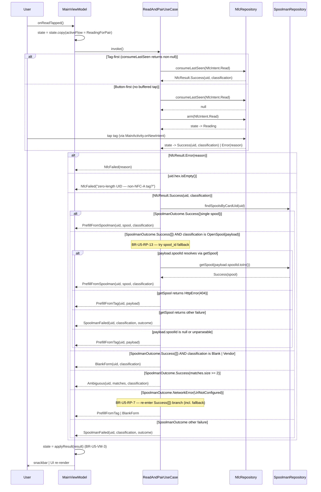

# U5 — Business Logic Model

**Stage**: CONSTRUCTION → Functional Design Part 2 (artefact)
**Source plan**: `aidlc-docs/construction/plans/u5-read-and-pair-flow-functional-design-plan.md` (approved 2026-05-25)
**Companion artefacts**:
- `domain-entities.md` — types
- `business-rules.md` — rules (BR-U5-*)
- `frontend-components.md` — Compose surface

---

## 1. Components in U5

```
┌─────────────────────────────────────────────────────────────┐
│ ui/screens/main/                                            │
│   MainScreen (Compose)                                      │
│   MainViewModel                                             │
│   MainUiState (and slices: FormState, SpoolmanState, …)     │
├─────────────────────────────────────────────────────────────┤
│ ui/components/                                              │
│   SpoolmanDropdown (Compose)         (impl in U5)           │
├─────────────────────────────────────────────────────────────┤
│ domain/usecases/                                            │
│   ReadAndPairUseCase                                        │
│   ReadAndPairResult (sealed)                                │
├─────────────────────────────────────────────────────────────┤
│ domain/models/                                              │
│   Brand                                (NEW in U5)          │
│   TempRanges                           (NEW in U5)          │
└─────────────────────────────────────────────────────────────┘
```

`NfcRepository` (U4), `SpoolmanRepository` (U3), `SettingsRepository` (U1), `MaterialDatabase` (v1) are reused as-is.

---

## 2. Read-and-Pair sequence (final, from services.md §2)



---

## 3. ViewModel state machine (`activeFlow`)

```mermaid
stateDiagram-v2
    [*] --> Idle
    Idle --> ReadingForPair: onReadTapped
    ReadingForPair --> Idle: ReadAndPairResult delivered
    ReadingForPair --> ReadingForPair: onReadTapped (re-tap; BR-U5-VM-2)\n— internally disarm + re-arm
    Idle --> Idle: onSpoolSelected (no flow change)
```

Future units extend `ActiveFlow` with `Writing | Verifying | Repairing | TwoTag | VendorOptIn | RawWriting`. U5 must include a defensive `else` branch in any exhaustive `when (state.activeFlow)` so adding members later doesn't trigger compile breakage in U5 code paths — but the Code Generation plan can also gate this with an explicit U6a/U7 TODO.

---

## 4. State derivation diagram

```
NfcRepository.state            ──────────► MainUiState.nfc
                                            (typealias = NfcResult)

SpoolmanRepository.spools      ──────────► MainUiState.spoolman.spools

SettingsRepository.settings    ──────────► MainUiState.spoolman.urlConfigured
  .url.isNotBlank()

(none in U5)                   ──────────► MainUiState.banner = Hidden

ReadAndPairResult              ──────────► MainUiState.form
                                            MainUiState.activeFlow
                                            MainUiState.ambiguity
                                            MainUiState.spoolman.selectedSpoolId

onSpoolSelected                ──────────► MainUiState.form
                                            MainUiState.ambiguity
                                            MainUiState.spoolman.selectedSpoolId
```

The VM uses three independent `viewModelScope.launch { ... .collect { ... } }` blocks (one per source flow) plus inline updates from `onReadTapped` / `onSpoolSelected`. No `combine` operator is required — slices are independent.

---

## 5. Threading model

Per Q-DP4=A in `component-methods.md` §8:

- `MainViewModel` coroutines launched on `viewModelScope` (Main by default).
- `ReadAndPairUseCase.invoke()` is `suspend` and main-safe (delegates to repositories which already manage their own dispatchers).
- `nfc.consumeLastSeen(...)` and `nfc.arm(...)` use the IO dispatcher internally (U4); the use-case does not add a `withContext`.
- `spoolman.findSpoolsByCardUid(...)` uses IO internally (U3).
- Tests use `runTest` + `Dispatchers.setMain(testDispatcher)` (no injected `DispatcherProvider`).

---

## 6. Error-surface taxonomy

| Source | Where caught | Where surfaced |
|---|---|---|
| `NfcResult.Error(reason, cause?)` | `ReadAndPairUseCase` (BR-U5-RP-8) | `NfcFailed(reason)` → `UiEffect.ShowSnackbar(reason)` |
| `SpoolmanOutcome.HttpError(code, msg)` | `ReadAndPairUseCase` (BR-U5-RP-5) | `SpoolmanFailed(...)` → `UiEffect.ShowSnackbar(humanReadable(outcome))` |
| `SpoolmanOutcome.NetworkError(cause)` (cause ≠ `UrlNotConfigured`) | `ReadAndPairUseCase` | `SpoolmanFailed(...)` → snackbar |
| `SpoolmanOutcome.NetworkError(UrlNotConfigured)` | `ReadAndPairUseCase` (BR-U5-RP-7) | Silent — falls through to `PrefillFromTag` / `BlankForm` |
| `SpoolmanOutcome.ParseError(cause)` | `ReadAndPairUseCase` | `SpoolmanFailed(...)` → snackbar |
| `Throwable` (other) | NOT caught — bubbles to coroutine handler | App will crash. Repository contracts (U3/U4) wrap exceptions into outcomes/results; anything escaping is a programming error. |

`CancellationException` is NOT caught (BR-U5-RP-10) — propagates through normal coroutine cancellation.

---

## 7. Cross-cutting flow integration points

### 7.1 Settings → URL configured

`MainViewModel` collects `settingsRepository.settings` and projects `url.isNotBlank()` into `MainUiState.spoolman.urlConfigured`. The use-case does **not** read `SettingsRepository`; instead it relies on `findSpoolsByCardUid` returning `NetworkError(UrlNotConfigured)` when the URL is empty (per U3 plan §2.2.5). This keeps the use-case oblivious to settings.

### 7.2 Settings → Compose top-bar nav

`MainViewModel.onSettingsTapped()` (stub in U5) emits `UiEffect.Navigate("settings")`. `MainScreen` listens for `Navigate` effects and routes to a placeholder Settings screen (U9 lands the real one).

### 7.3 NFC `lastSeenTag` is NOT directly observed by U5

The use-case uses `consumeLastSeen(Read)` (single-shot, mutating) rather than observing `lastSeenTag` flow. The VM does **not** observe `lastSeenTag` either. This avoids race conditions between TTL expiry and `arm`'s state machine. Only `NfcRepository.state` is observed continuously by the VM.

### 7.4 Settings nav fallthrough — Compose-side requirement

`MainScreen` collects VM `effects` flow and handles:
- `ShowSnackbar(message)` → `SnackbarHostState.showSnackbar(message)` on a remembered `LaunchedEffect`.
- `Navigate("settings")` → `onNavigateToSettings()` callback hoisted to caller (placeholder lambda in U5; real wiring in U9).

---

## 8. Boundaries — what U5 doesn't decide

- `MainScreen`'s exact pixel layout, colour palette, motion design — Code Generation plan handles this within v2 theme.
- Material/Brand catalogue completeness — U8.
- Banner copy + Retry control — U9.
- v2.1 vendor decoding — U11/U12.
- The "Refresh" affordance — U9 (per Q-U5-5=A).

---

## 9. Failure modes and recovery (high-level)

| Failure | Recovery |
|---|---|
| User taps Read but never taps a tag | Re-tap Read → BR-U5-VM-2 disarms and re-arms. Or the user navigates away and the repository still has the buffered intent (no impact since the ViewModel cleared `activeFlow` only on result). The next `arm` from any caller implicit-disarms. |
| User taps a tag without Read armed | `NfcRepository.lastSeenTag` is populated (U4 BR-U4-SM-11). Next `onReadTapped` → use-case calls `consumeLastSeen(Read)` and gets the buffered tap if within TTL. |
| Spoolman call returns 404 from a misconfigured URL | `HttpError(404, ...)` → `SpoolmanFailed` → snackbar. User goes to Settings to fix URL. |
| `MainScreen` recomposed during a read | `MainViewModel` is `@HiltViewModel` and survives recomposition. The use-case invocation is on `viewModelScope`. No state loss. |
| Process death during a read | `viewModelScope` cancels; the in-flight `invoke()` is cancelled. New process starts with fresh `MainUiState()`. The user sees `Idle` and re-taps Read. (Acceptable for a tap-driven flow — no background work to resume.) |

---

## 10. Compose-side composition rule (high-level — frontend-components.md elaborates)

`MainScreen` consumes only `MainUiState` and exposes intent callbacks to `MainViewModel`. No business logic in Compose. All branching (`Ambiguous` UI vs prefill UI vs reading hint) is driven by the U5 sealed types and `MainUiState` slices. State hoisting follows the Compose idiom (Compose components are stateless where possible).
