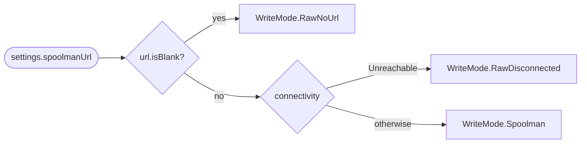
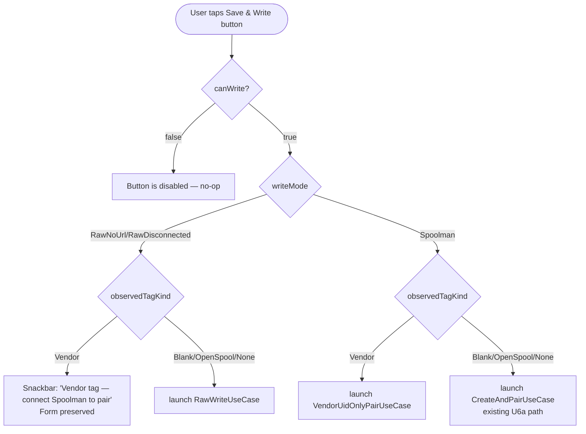
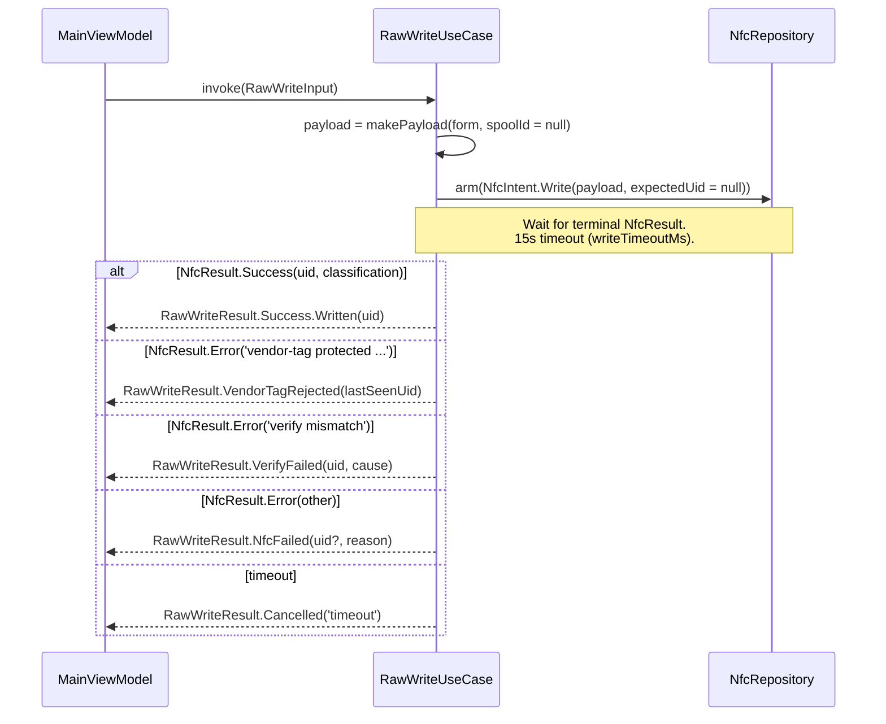
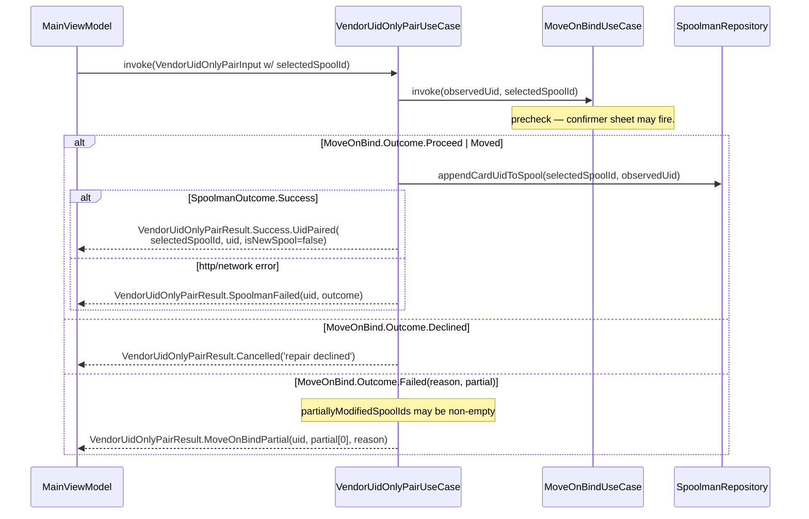
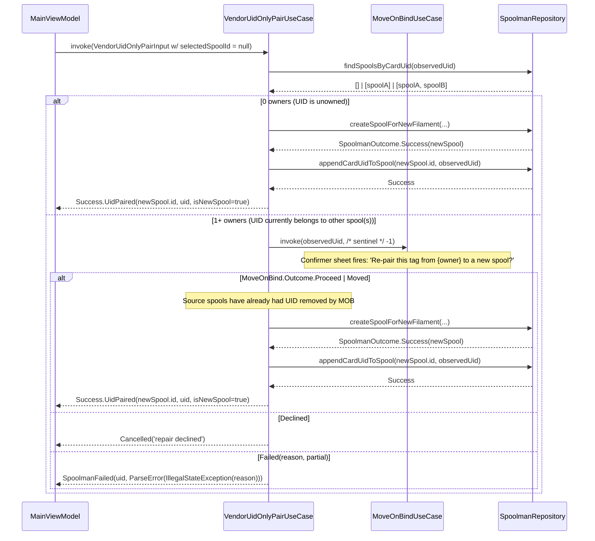
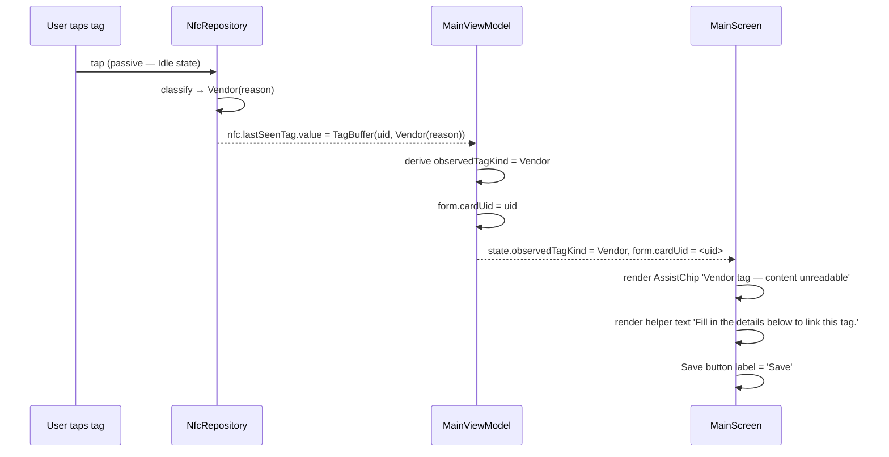
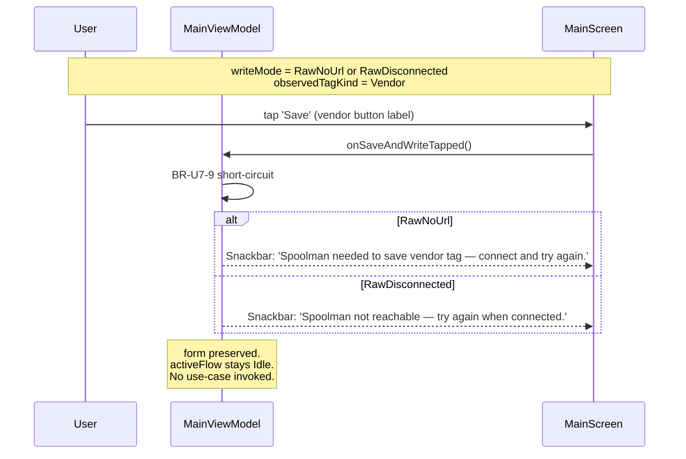
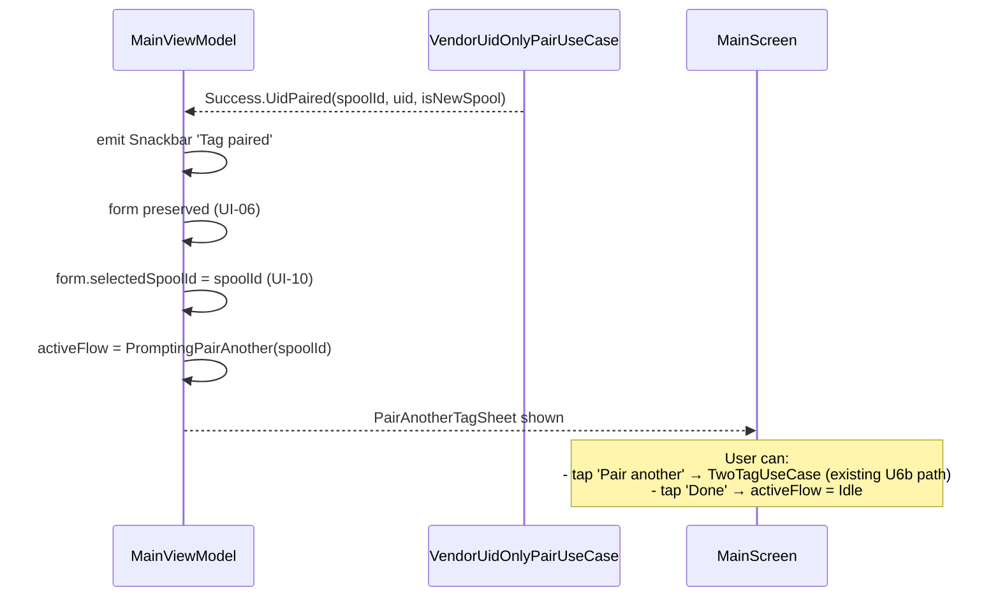
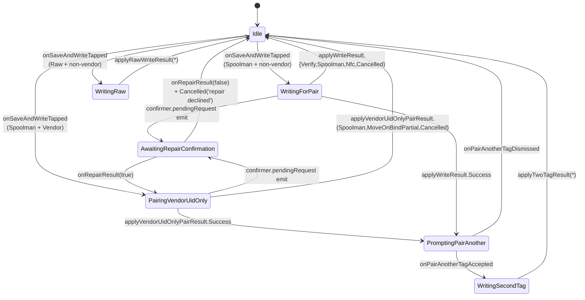

# U7 — Business Logic Model

**Stage**: CONSTRUCTION → Functional Design (U7 — Side Modes)
**Source plan**: `aidlc-docs/construction/plans/u7-side-modes-functional-design-plan.md`
**Reflects**: Q-U7-1..15 outcomes (locked 2026-05-27) + D-U7-1..5

---

## 1. Mode-derivation flow

`MainViewModel.writeMode` is recomputed every time either input changes.
No persistence, no toggle.

---

## 2. Save & Write dispatch

---

## 3. RawWriteUseCase happy + error paths

**Invariants**:
- ✅ Zero `SpoolmanRepository` calls (verified by ctor: no Spoolman dep injected).
- ✅ `payload.spoolId == null` (FR-4.8).
- ✅ FR-4.7 vendor protection inherited from `NfcRepository.runWriteThenVerify`.
- ✅ FR-4.5 verify inherited from `NfcRepository.runWriteThenVerify`.

---

## 4. VendorUidOnlyPairUseCase — existing-spool path

**Invariants**:
- ✅ Zero `nfc.arm` calls (verified by ctor: no `NfcRepository` injected).
- ✅ Move-on-bind always before append (per [[BR-U7-11]]).

---

## 5. VendorUidOnlyPairUseCase — new-spool path

The new-spool path has a subtlety: move-on-bind runs *before* the spool
exists. The use-case orders calls so the source-spool detach happens
first, the new spool is created next, and the new spool finally claims
the UID via `appendCardUidToSpool`.

> **Sentinel `targetSpoolId = -1` open question** for code-gen: the
> existing `MoveOnBindUseCase.invoke(uid, targetSpoolId)` signature
> assumes a real target id. For the new-spool path we don't have one yet.
> Two implementation options at code-gen time:
>
> 1. Pass `-1`; have `MoveOnBindUseCaseImpl` detect the sentinel and skip
>    the "already on target" idempotency check (since there is no target).
>    The user's confirmation is then "remove the UID from {owner}, period."
> 2. Add a new `MoveOnBindUseCase.detachFromAll(uid)` method that just
>    sweeps the source spools without a target.
>
> Defer pick to code-gen Part 1; both are sound. The plan default is
> option 1 because it requires no API addition.

---

## 6. Vendor-tag observed → UI signal

No flow state transition — `activeFlow` stays `Idle`. The chip + button
copy are pure derived UI; the use-case launches only when the user taps
Save.

---

## 7. Vendor refusal — no Spoolman

---

## 8. Pair another tag — vendor success branch

> **Second-tag-vendor footgun, deferred**: if the user taps another vendor
> tag during the pair-another flow, `TwoTagUseCase` still emits
> `VendorTagRejected` (existing U6b behaviour). Routing that into the
> vendor flow is **out of U7 scope** per [[Q-U7-9]] note. User can fall
> back to manual: dismiss the sheet, tap the second vendor tag at idle,
> then Save.

---

## 9. State-machine summary

`ActiveFlow` transitions involving U7 use-cases:

**Pre-existing transitions** (from U6b) shown for completeness; U7 adds
`WritingRaw` and `PairingVendorUidOnly` and reuses
`AwaitingRepairConfirmation` + `PromptingPairAnother`.

---

## 10. Error precedence (snackbar copy)

When multiple error conditions stack, U7 dispatches in this priority:

| Priority | Condition | Snackbar |
|---|---|---|
| 1 | Vendor tag + RawNoUrl | "Spoolman needed to save vendor tag — connect and try again." |
| 2 | Vendor tag + RawDisconnected | "Spoolman not reachable — try again when connected." |
| 3 | RawWriteResult.VendorTagRejected | "Vendor tag — content unreadable" (informational; usually never reached because precondition rules above intercept) |
| 4 | RawWriteResult.VerifyFailed | (carry over from existing copy review at U10) |
| 5 | RawWriteResult.NfcFailed | (carry over) |
| 6 | RawWriteResult.Cancelled('timeout') | (carry over) |
| 7 | VendorUidOnlyPairResult.SpoolmanFailed | `humanReadable(outcome)` (existing plumbing) |
| 8 | VendorUidOnlyPairResult.MoveOnBindPartial | (carry over from U6b polish — UI-07 covers final wording) |
| 9 | VendorUidOnlyPairResult.Cancelled('repair declined') | suppressed per UI-12 (already shipped) |
