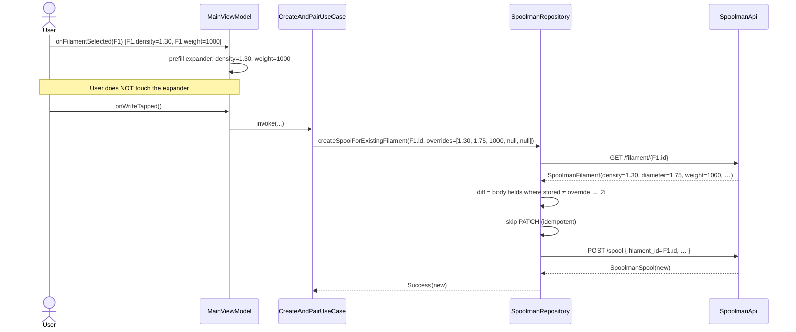
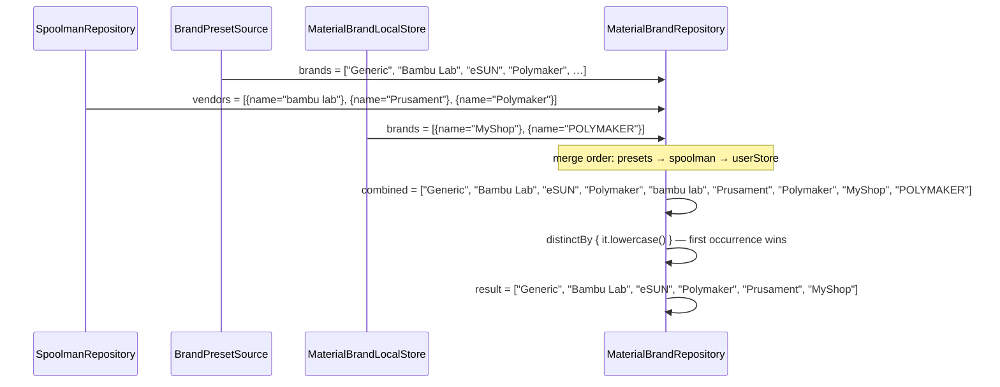
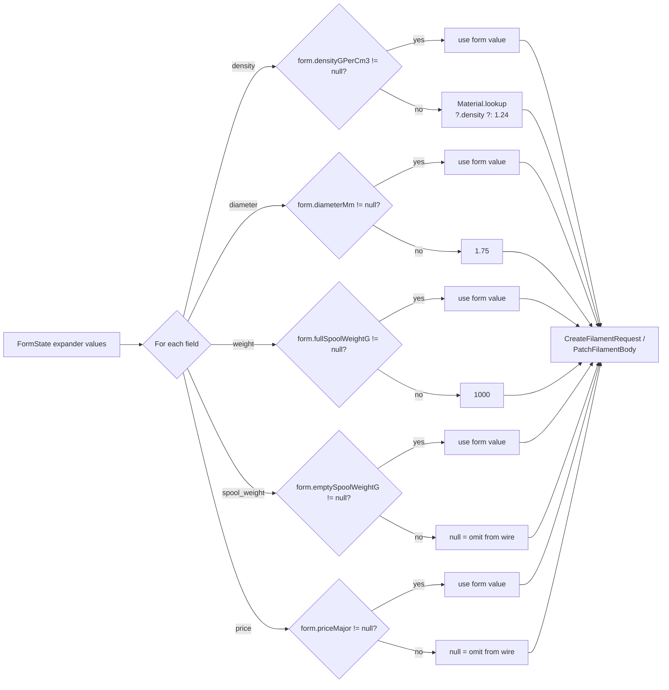

# U8 — Business Logic Model

**Stage**: CONSTRUCTION → Per-Unit Loop → Functional Design → Business Logic Model
**Unit**: U8 — Pickers + Custom Entries + Filament Metadata UX
**Locked**: 2026-05-28

Sequence diagrams for the four key flows. Implementation lives in U8 Code Generation; this is the contract.

---

## 1. Filament-pick happy path (Δ-1) — works for both 0-spool and 1+-spool filaments

```mermaid
sequenceDiagram
    actor U as User
    participant FP as FilamentPicker (Compose)
    participant VM as MainViewModel
    participant UC as CreateAndPairUseCase
    participant SR as SpoolmanRepository
    participant NR as NfcRepository
    participant API as SpoolmanApi

    U->>FP: Expand "Filament ▾"
    FP->>VM: onFilamentSectionToggled()
    VM->>VM: form.filamentSectionExpanded = true
    U->>FP: Pick filament F1
    FP->>VM: onFilamentSelected(F1)
    VM->>VM: form.copy(selectedFilamentId=F1.id, selectedSpoolId=null)
    VM->>VM: FormMapping.fromFilament(F1) → prefill material/color/temps/expander
    Note over U,FP: Form populated; user taps Save & Write
    U->>VM: onWriteTapped()
    VM->>UC: invoke(input.copy(selectedFilamentId=F1.id))
    UC->>SR: createSpoolForExistingFilament(F1.id, expanderOverrides)
    SR->>API: GET /filament/{F1.id}
    API-->>SR: SpoolmanFilament(stored)
    alt expander overrides differ from stored
        SR->>SR: patchFilament(F1.id, diffBody)
        SR->>API: PATCH /filament/{F1.id}
        API-->>SR: SpoolmanFilament(updated)
        SR->>SR: cache.update(updated)
    else all overrides match stored
        Note over SR: idempotent skip — no HTTP call
    end
    SR->>API: POST /spool { filament_id=F1.id, extra={...} }
    API-->>SR: SpoolmanSpool(new)
    SR->>SR: cache.append(new)
    SR-->>UC: Success(spool=new)
    UC->>NR: arm(Write(payload, expectedUid=null))
    NR-->>UC: NfcResult.Success(uid)
    UC->>SR: appendCardUidToSpool(new.id, uid)
    SR-->>UC: Success(spool with extra.card_uids)
    UC-->>VM: Success.WrittenAndPaired(...)
    VM->>VM: form preserved; activeFlow = PromptingPairAnother
```

**Notes**:
- The flow is identical regardless of whether F1 had 0 spools or 1+ spools before the pick. Spoolman accepts multiple spools per filament; we just create another one.
- PATCH idempotency check happens before `createSpool` (BR-U8-21). If PATCH fails, `createSpool` is not called (fail-fast).
- The post-success flow (`PromptingPairAnother`) reuses U6b's pair-another-tag sheet (BR-U8-23 routing identical for all branches).

---

## 2. PATCH idempotency — pick filament, don't change anything



**Verification**: zero PATCH HTTP calls observable in `adb logcat` for an unchanged-pick. Asserted in `SpoolmanRepositoryPatchFilamentTest.patch_all_values_match_no_HTTP_call` (BR-U8-19).

---

## 3. Add custom material → auto-select round-trip (FR-8.5)

```mermaid
sequenceDiagram
    actor U as User
    participant MP as MaterialPicker (Compose)
    participant SH as AddCustomMaterialSheet
    participant SVM as AddCustomMaterialViewModel
    participant VM as MainViewModel
    participant MBR as MaterialBrandRepository
    participant DS as DataStore<CustomMaterials>

    U->>MP: Tap dropdown
    MP->>MP: Render presets + "➕ Add custom material…" footer
    U->>MP: Tap footer
    MP->>VM: onAddCustomMaterialOpened()
    VM->>VM: activeFlow = AddingCustomMaterial
    SH->>SVM: hydrate empty UiState
    U->>SH: Type "PA-CF" + temps 230/260 / 80/100
    SVM->>SVM: sanitise: take(8) → uppercase → "PA-CF"
    Note over SH,SVM: Save enabled (validation passes)
    U->>SH: Tap Save
    SH->>SVM: onSave()
    SVM->>VM: onAddCustomMaterialConfirmed(Material("PA-CF", …))
    VM->>MBR: addCustomMaterial(material)
    MBR->>DS: updateData { addEntries(...) }
    DS-->>MBR: ack
    MBR->>MBR: materials StateFlow re-emits (deduped merge)
    VM->>VM: form.copy(material = "PA-CF"); activeFlow = Idle
    SH->>SH: dismiss
    Note over MP: Picker re-renders; "PA-CF" selected
```

**Auto-select rule**: BR-U8-11 — sheet confirms → DataStore writes → form's material field = new entry's name → picker shows it as selected.

---

## 4. Brand merge precedence — preset / Spoolman / user-added collision



**Outcomes**:
- "bambu lab" (Spoolman) deduped against "Bambu Lab" (preset) → preset's spelling wins.
- "Polymaker" (Spoolman) deduped against "Polymaker" (preset) → identical, preset wins by enumeration order.
- "POLYMAKER" (user) deduped against "Polymaker" (preset) → user-added drop.
- "Prusament" (Spoolman only) → kept as-is.
- "MyShop" (user only) → kept as-is.

**Stability**: if Spoolman becomes unreachable mid-session and `vendors` clears, the list reshapes to `["Generic", "Bambu Lab", "eSUN", "Polymaker", "MyShop"]` — losing "Prusament" but preserving everything else. Presets first means UI doesn't reorder when Spoolman state flutters.

---

## 5. Default-fallback computation at the call site



**Caller**: `CreateAndPairUseCase.makePayload()` for the create-new-filament branch; `SpoolmanRepository.createSpoolForExistingFilament` for the pick-existing branch (where the diff is computed against the stored filament after applying the same fallback rules).

**Why call-site fallback (not Spoolman default)**: Spoolman's `density` / `diameter` / `weight` are required (`gt=0`) — sending null returns 422. The U6a OPEN-1 fix established the pattern of computing fallbacks at the call site; U8 honours it.

---

## 6. State-machine summary — `ActiveFlow` extensions for U8

| State | Trigger | UI | Exit |
|---|---|---|---|
| `Idle` | (existing) | Form + spool dropdown enabled | any user action |
| `AddingCustomMaterial` (NEW) | Tap "➕ Add custom material…" footer | `AddCustomMaterialSheet` modal | `onAddCustomMaterialConfirmed` → `Idle` (form auto-selects new); `onDismiss` → `Idle` |
| `AddingCustomBrand` (NEW) | Tap "➕ Add custom brand…" footer | `AddCustomBrandSheet` modal | mirror of above |

**No new states for the filament picker** — selection is form-state only (`form.selectedFilamentId`); doesn't gate the form. Save & Write button enabled per existing predicate.

**No new states for the More details expander** — toggle is form-state only (`form.moreDetailsExpanded`); doesn't gate anything.

---

## 7. Out-of-scope flows (deferred / never)

- **Filament metadata edit without spool create** — no use case. Edits ride along on the next Save & Write that lands on the filament (BR-U8-21). (Per delta §3.)
- **Repairing duplicate filaments** in Spoolman — user-side dedup task. v2.0 doesn't surface a "merge filaments" tool.
- **Per-brand `spool_weight` defaults** — explicitly not added (BR-U8-16 carve-out): null is safer than wrong defaults that cause silently-wrong remaining-weight readings.
- **Persisting `moreDetailsExpanded` / `filamentSectionExpanded` across app launches** — both default false on every app start.
