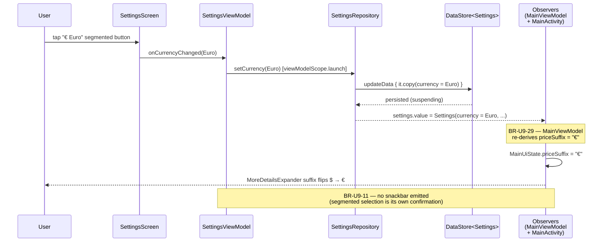
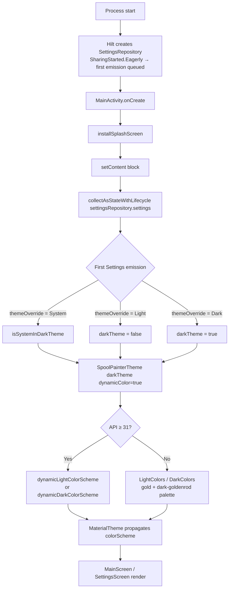
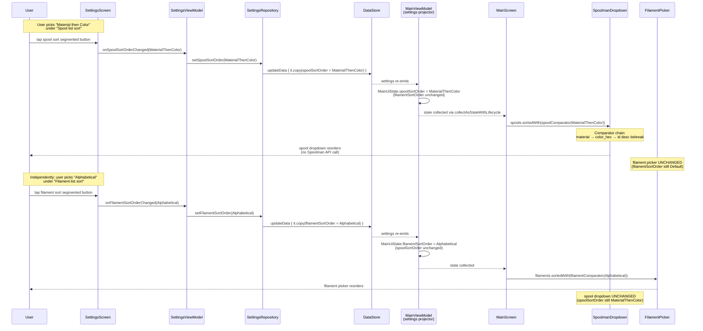
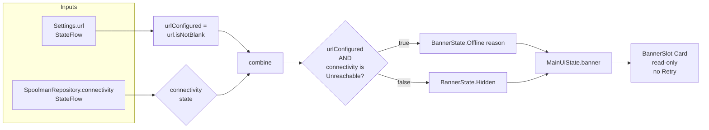

# U9 — Business Logic Model

**Stage**: CONSTRUCTION → Per-Unit Loop → Functional Design → Business Logic Model
**Unit**: U9 — Settings + Theming + UI Shell
**Locked**: 2026-05-29 (revised same day per user direction — theme moves to TopAppBar; sort splits into spool + filament)

Source plan: `aidlc-docs/construction/plans/u9-settings-theming-banner-functional-design-plan.md`. Diagrams below model the runtime data flow; static dependencies live in `domain-entities.md`; declarative rules live in `business-rules.md`.

---

## 1. Settings change → DataStore round-trip (representative: currency)

The same shape applies to all five Settings setter paths (`setUrl` / `setSpoolSortOrder` / `setFilamentSortOrder` / `setThemeOverride` / `setCurrency`). Diagram uses currency as the representative.



**Invariants** (cross-ref BR-U9-5):
- All five setters are `suspend`; UI emission via `StateFlow` only after `DataStore.updateData` returns.
- No optimistic UI; the segmented button's `selected` state binds directly to `state.currency`, so the highlight reflects actual persisted state on next emission.
- `SharingStarted.Eagerly` on the repository's `StateFlow` (`SettingsRepositoryImpl.kt:23-27`) ensures the projection survives configuration changes.

---

## 2. Cold-start theme resolution (BR-U9-18, BR-U9-21)



**Invariants**:
- Splash screen shows the platform default; brand-themed splash deferred to U9b. No theme-flicker risk because `Eagerly`-started flow has its first value before `setContent`'s composition runs.
- `dynamicColor = true` is hardcoded at the call site; no Settings-resident toggle (Q-U9-8=A; forward-compat path documented in `domain-entities.md` §6).
- The TopAppBar cycle icon (BR-U9-19a..d) is rendered as part of `MainScreen` inside the same composition — its initial state mirrors `Settings.themeOverride` from the same `Eagerly`-started flow.

---

## 3. Theme override change at runtime — TopAppBar cycle (BR-U9-19a..d, BR-U9-20)

```mermaid
sequenceDiagram
    participant U as User
    participant TB as MainScreen<br/>TopAppBar
    participant TI as ThemeCycleIconButton
    participant MV as MainViewModel
    participant R as SettingsRepository
    participant DS as DataStore
    participant MA as MainActivity<br/>(setContent collector)
    participant SPT as SpoolPainterTheme
    participant UI as Compose tree

    Note over TB,TI: Initial: themeOverride = System<br/>(icon: BrightnessAuto)
    U->>TI: tap cycle icon
    TI->>MV: onThemeCycleTapped()
    MV->>MV: next = when(System) -> Light
    MV->>R: setThemeOverride(Light)
    R->>DS: updateData { it.copy(themeOverride = Light) }
    DS-->>MV: settings emits
    MV->>TI: themeOverride.value = Light<br/>(icon flips to LightMode/sun)
    DS-->>MA: settings = Settings(themeOverride = Light, ...)
    Note over MA: collectAsStateWithLifecycle re-emits;<br/>setContent body recomposes
    MA->>MA: darkTheme = when(Light) -> false
    MA->>SPT: SpoolPainterTheme(darkTheme=false, dynamicColor=true)
    SPT->>SPT: colorScheme = dynamicLightColorScheme<br/>(or LightColors pre-Android-12)
    SPT->>UI: CompositionLocalProvider(colorScheme)
    UI-->>U: status bar + surfaces flip light
    Note over MV,UI: No Activity.recreate(); pure recomposition.<br/>Next tap: Light → Dark; then Dark → System.
```

**Invariants** (BR-U9-19a..d, BR-U9-20):
- Cycle order is `System → Light → Dark → System` (locked per Q-U9-13=A).
- `MainViewModel.themeOverride` is a standalone `StateFlow` — separate from `MainUiState`. Theme tap recomposes only the topbar icon + the `MaterialTheme` colorScheme, not the form's state holders.
- No `LaunchedEffect`; no `SideEffect` other than the existing status-bar tinting block in `Theme.kt:67-71`.
- BR-U9-22: `WindowCompat.getInsetsController(...).isAppearanceLightStatusBars = !darkTheme` runs inside the existing `SideEffect` guard (`!view.isInEditMode`); status bar foreground icons flip to match.
- BR-U9-19c: no snackbar emitted on cycle tap.
- BR-U9-19d: icon `contentDescription` updates with current state; TalkBack reads "Theme: Light (tap to switch to Dark)" etc.

---

## 4. Sort order change → independent dropdowns (BR-U9-13a, BR-U9-13b, BR-U9-17)

Two independent pipelines — spool sort and filament sort each round-trip through their own `Settings` field, their own setter, and their own `MainUiState` projection. Changing one does not change the other.



**Invariants**:
- BR-U9-17: zero Spoolman API round-trips on sort change (either side).
- BR-U9-15: `SpoolmanDropdown` filters `archived` spools **before** sorting; comparator never sees archived items.
- BR-U9-16: filament-picker default behavior changes (was display-string ascending; now id descending). One-time observable change documented in close-out summary.
- BR-U9-13a/b: the two pipelines are fully independent — no derived "shared sort"; `SettingsViewModel` exposes two distinct handlers; `MainUiState` carries two distinct fields.

---

## 5. Banner derivation (BR-U9-23, BR-U9-24)



**Invariants** (cross-ref BR-U9-24, BR-U9-26):
- Banner is a pure derivation of two flows — no I/O, no `LaunchedEffect`. Trivially testable with fake repos (already shipped pattern in `MainViewModelTest`).
- `Hidden` covers three of four input combinations; `Offline` only fires when both URL is configured AND connectivity is `Unreachable`.
- BR-U9-26: banner is **not clickable**; gear icon is the canonical Settings entry point.
- BR-U9-27: S-10.2 "Retry control" AC closed via `requirements-delta-banner-passive.md` (Q-U9-10=B).

---

## 6. Currency → priceSuffix derivation (BR-U9-29, BR-U9-30)

```mermaid
sequenceDiagram
    participant DS as DataStore<Settings>
    participant SR as SettingsRepository<br/>.settings: StateFlow
    participant MV as MainViewModel<br/>(settings projector)
    participant MUS as MainUiState
    participant MS as MainScreen
    participant FF as FilamentForm
    participant MDE as MoreDetailsExpander

    DS-->>SR: Settings(currency = Euro, ...)
    SR-->>MV: settings.collect
    MV->>MV: priceSuffix = settings.currency.symbol → "€"
    MV->>MUS: state.update { copy(priceSuffix = "€") }
    MUS-->>MS: state.priceSuffix = "€"
    MS->>FF: priceSuffix = "€"
    FF->>MDE: priceSuffix = "€"
    MDE-->>User: DecimalField(suffix = "€", ...)
    Note over MV,MDE: BR-U9-31 — symbol is purely visual;<br/>stored Float price unchanged
```

**Invariants**:
- BR-U9-31: `Float? price` payload sent to / read from Spoolman is unchanged. Currency is client-side only.
- BR-U9-29: `priceSuffix` is a pre-derived `String`, not a `Currency` enum (Q-U9-12=A). Leaf composable stays decoupled from the enum.
- Default `Currency.Dollar.symbol == "$"` matches today's hard-coded value at `MoreDetailsExpander.kt:107`.

---

## 7. State summary

No new state-machine variants. U9 is purely state-projection extensions:

| Source state | Projected onto | New? |
|---|---|---|
| `Settings.url` | `MainUiState.banner` (via combine with connectivity) | existing |
| `Settings.spoolSortOrder` | `MainUiState.spoolSortOrder` | NEW |
| `Settings.filamentSortOrder` | `MainUiState.filamentSortOrder` | NEW |
| `Settings.themeOverride` | `MainViewModel.themeOverride: StateFlow` (standalone) **+** `MainActivity.setContent.darkTheme` | NEW |
| `Settings.currency` | `MainUiState.priceSuffix` | NEW |

`ActiveFlow`, `BannerState`, `SortOrder`, `ThemeOverride` enums are unchanged. Only `Currency` is net-new (`domain-entities.md` §1.1).

---

## 8. Concurrency model

- All Settings setters are `suspend`. They run on `viewModelScope` in `SettingsViewModel` (URL save / spool-sort / filament-sort / currency) and `MainViewModel` (theme cycle) — no UI thread blocking.
- `SettingsRepository.settings: StateFlow<Settings>` is `SharingStarted.Eagerly` with `externalScope: CoroutineScope` (`@AppScope`). Ensures cold-start emission lands before consumers attach.
- `MainViewModel.combine(settings, connectivity)` runs in `viewModelScope`. `distinctUntilChanged()` upstream of `collect` (matching existing `MainViewModel.kt:179`) suppresses redundant `_state.update` calls when neither input changed value.
- `MainViewModel.themeOverride` is a side StateFlow (`stateIn(viewModelScope, Eagerly, System)`) — separate emission path from `MainUiState`'s combine. Theme cycle does **not** trigger a `MainUiState` re-emission.
- `MainActivity.setContent`'s `collectAsStateWithLifecycle` is bound to the activity lifecycle — survives config changes; pauses on `STARTED → CREATED` transitions.

No new locks, channels, or actors. U9 stays inside the existing reactive Flow + Compose recomposition contract.
