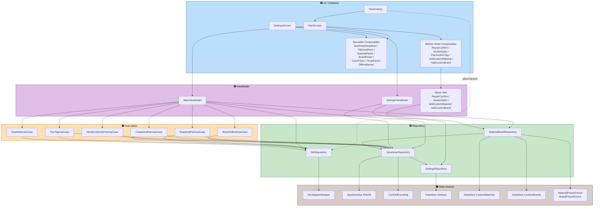

# Application Design — SpoolPainter v2

**Stage**: INCEPTION → Application Design (consolidated artifact 5/5)
**Source**: `aidlc-docs/inception/plans/application-design-plan.md` (answered)
**Detail level**: Comprehensive (per execution plan).
**Companion artifacts**:
- `components.md` — component catalogue
- `component-methods.md` — method signatures
- `services.md` — multi-step flow orchestration
- `component-dependency.md` — dependencies + Hilt grouping
- `application-design-component-diagram.png` / `.svg` / `.mmd` — rendered component diagram

---

## 1. Decisions Index (from answered plan)

| Question | Answer | Decision |
|---|---|---|
| Q-CI1 | C | Bottom sheets live in `ui/components/sheets/` (reusable Composables). |
| Q-CI2 | B | Split `data/local/presets/` (hardcoded) vs. `data/local/userdata/` (user-added) for clearer read-only / mutable separation. |
| Q-CI3 | C | Split: value primitives → `domain/primitives/`; presentation models stay in `domain/models/`. |
| Q-CI3 (note) | — | `CardUidEncoding` lives at `data/remote/spoolman/CardUidEncoding.kt` (decoupled from `lot_nr` so it survives the FR-2.4 migration to `extra.card_uid`). |
| Q-CI4 | B | No v2.1 `VendorTagDecoder` interface in v2.0 — defer abstraction. v2.0's `TagClassification.Vendor(reason)` is the hook v2.1 will refine. |
| Q-CM1 | D | `NfcRepository` exposes `state: StateFlow<NfcResult>` + `lastSeenTag: StateFlow<TagBuffer?>` (TTL buffer for tag-first path) + `arm()` / `consumeLastSeen()` / `disarm()`. |
| Q-CM2 | B | `SpoolmanRepository` returns sealed `SpoolmanOutcome<T>` (Success / HttpError / NetworkError / ParseError). |
| Q-CM3 | SUPERSEDED | Q-CI3's `CardUidEncoding` extraction made this question moot. No standalone `LotNr` primitive type. |
| Q-CM4 | C | `MainViewModel` for screen-level state + per-bottom-sheet ViewModels for modal sub-flows. |
| Q-S1 | B | Use-cases for multi-step flows only: `ReadAndPair`, `CreateAndPair`, `MoveOnBind`, `TwoTag`, `VendorUidOnlyPair`, `RawWrite`. |
| Q-S2 | A | FR-7 chain encapsulated in `SpoolmanRepository.createSpoolForNewFilament(...)` (one public method, internal sequencing private). |
| Q-S3 | C | Move-on-bind two-PATCH sequence in `MoveOnBindUseCase`. Repository exposes the primitives only. |
| Q-S4 | A | In-memory cache (NFR-7.2) inside `SpoolmanRepository` as `StateFlow<List<…>>`; invalidated on PATCH/POST. |
| Q-CD1 | A | `SpoolmanRepository.connectivity: StateFlow<ConnectivityState>` is the single source of truth. |
| Q-CD1.1 | A | Banner is **passive read-only** (no Retry button). Banner suppressed entirely when URL is empty. **Test connection** lives only in Settings. |
| Q-CD2 | A | DataStore Proto for `MaterialBrandLocalStore` (small, no real queries; case-insensitive dedup in repo, not in store). |
| Q-CD3 | B | Per-layer Hilt modules: `NetworkModule`, `RepositoryModule`, `DataStoreModule`, `NfcModule`. |
| Q-CD4 | A | `NfcRepository.attach(activity)` / `detach()` called from `MainActivity.onResume` / `onPause`. |
| Q-DP1 | A | Single `StateFlow<UiState>` per VM with sealed sub-states. |
| Q-DP2 | C | Methods for primary actions; sealed events for bottom-sheet results. |
| Q-DP3 | C | Persistent banner state in `UiState` (connectivity); transient errors via Snackbar. |
| Q-DP4 | A | `viewModelScope` for VM ops; `Dispatchers.IO` only inside repositories around blocking APIs (NFC). |

---

## 2. Component Diagram

The same diagram is rendered to PNG/SVG via mermaid-cli — see
`application-design-component-diagram.{png,svg,mmd}` next to this file.

---

## 3. v2.0 Functional Surface (mapped)

| FR / NFR | Components / Flows |
|---|---|
| FR-1 (UID identity) | `NfcRepository`, `CardUid`, `NfcResult`, `TagClassification` |
| FR-2 (`lot_nr` ↔ UID format) | `CardUidEncoding`, `SpoolmanRepository.appendCardUidToSpool` / `removeCardUidFromSpool` |
| FR-3 (Read-and-Pair) | `MainViewModel.onReadTapped`, `ReadAndPairUseCase`, `services.md` §2 |
| FR-4 (Write/Create-and-Pair) | `MainViewModel.onWriteTapped`, `CreateAndPairUseCase`, `VendorUidOnlyPairUseCase`, `RawWriteUseCase`, `services.md` §3, §6, §7 |
| FR-4.7 (vendor-tag NDEF protection) | `NfcRepository` classification + `TwoTagUseCase` rejection branch |
| FR-4.9 (vendor UID-only pair) | `VendorUidOnlyOptInSheet`, `VendorOptInViewModel`, `VendorUidOnlyPairUseCase`, `services.md` §6 |
| FR-5 (Move-on-bind) | `MoveOnBindUseCase`, `RepairConfirmSheet`, `RepairConfirmViewModel`, `services.md` §4 |
| FR-6 (Two-tag) | `TwoTagUseCase`, `PairAnotherTagSheet`, `services.md` §5 |
| FR-7 (Spoolman create chain) | `SpoolmanRepository.createSpoolForNewFilament(...)` (Q-S2=A) |
| FR-8 (Material/brand presets + custom) | `MaterialBrandRepository`, `MaterialPresetSource`, `BrandPresetSource`, `MaterialBrandLocalStore`, `MaterialPicker`, `BrandPicker`, `AddCustomMaterialSheet`, `AddCustomBrandSheet` |
| FR-9 (Settings) | `SettingsScreen`, `SettingsViewModel`, `SettingsRepository` |
| FR-10 (Spoolman optional + offline) | `OfflineBanner`, `SpoolmanRepository.connectivity`, `SettingsScreen.onTestConnectionTapped` (Q-CD1.1=A) |
| FR-11 (Existing-tag display) | `NfcRepository` classification, `MainViewModel` form prefill |
| FR-12 (Theming) | `Theme.kt`, `SettingsRepository.themeOverride` |
| FR-13 (UI shape) | `MainScreen`, `SettingsScreen`, all bottom sheets (`ui/components/sheets/`) |
| FR-14 (Tag write content) | `OpenSpoolPayload`, `CreateAndPairUseCase`, `RawWriteUseCase` |
| FR-15 (Naming) | n/a — package id unchanged |
| NFR-1 (Architecture) | Layered MVVM + Repository + use-cases (Q-S1=B) + Hilt |
| NFR-1.4 (NFC sealed state) | `NfcResult` |
| NFR-2 (Hilt) | `NetworkModule`, `RepositoryModule`, `DataStoreModule`, `NfcModule` (Q-CD3=B) |
| NFR-3 (Persistence) | `SettingsRepository` (DataStore Settings); `MaterialBrandLocalStore` (DataStore Proto, Q-CD2=A); v2.1 `EncryptedSharedPreferences` for vendor keys |
| NFR-4.1 (Unit tests) | `CardUidEncoding`, `OpenSpoolPayloadParser`, `SpoolmanRepository`, `CardUid` canonicalisation |
| NFR-5 (Logging) | strip `Log.d/e` in release; debug-only logger (deferred to Functional Design) |
| NFR-6 (Write-then-verify) | `NfcRepository.arm(Write)` internal control flow (verify is part of the same call) |
| NFR-7 (Network) | `SpoolmanOutcome<T>`, `SpoolmanRepository.connectivity`, in-memory cache (Q-S4=A) |

---

## 4. Open Items propagated to Functional / NFR Design

| OD | What | Where |
|---|---|---|
| OD-1 | "Currently paired with" status row under Spoolman dropdown — not decided in this stage | Functional Design U5 (Read-and-Pair) |
| OD-2 | DataStore Proto vs Room — **decided as DataStore Proto** (Q-CD2=A); only revisit if richer queries appear | Closed |
| OD-3 (post-v2.1) | Spoolman `extra` field migration plan (FR-2.4) | Deferred to post-v2.1 |
| Sheet-VM-or-rememberable | Whether each bottom sheet truly needs its own VM vs. `remember`-scoped state | Functional Design per-sheet |

---

## 5. Validation Summary (Steps 8–9)

- **Round 1** completed 2026-05-24:
  - 13 of 16 questions crisp on first pass.
  - Q-CM3 marked SUPERSEDED in-place (Q-CI3 made it moot).
  - Q-S2 was blank; user picked **A** after recommendation.
  - Q-CD1 had an extra constraint about non-Spoolman users; resolved
    via Q-CD1.1 follow-up — user picked **A** (passive banner, refresh
    in Settings).
- **Contradictions detected**: none.
- **Ambiguities remaining**: none.
- **Status**: ready for approval gate (Step 12).

---

## 6. What's Next

After approval:

- Mark Application Design [x] in `aidlc-state.md`.
- Advance Current Stage to **Units Generation**.
- Units Generation will decompose the v2.0 surface into per-unit work
  packages following the U1..U10 preview in
  `aidlc-docs/inception/plans/execution-plan.md` (Recommended Unit
  Decomposition section), refined against this design.

For each v2.0 unit, the Construction phase will run:
1. Functional Design (per unit, where applicable) — business rules,
   edge cases, validation, error handling for that unit's components.
2. NFR Requirements / NFR Design (per unit) — tech-stack picks
   (DataStore Prefs vs Proto schema, Tink vs EncryptedSharedPreferences,
   etc.).
3. Code Generation (always, per unit).

Then a final Build & Test stage covers the v2.0 testing-track release
prep (per execution-plan.md U10).
