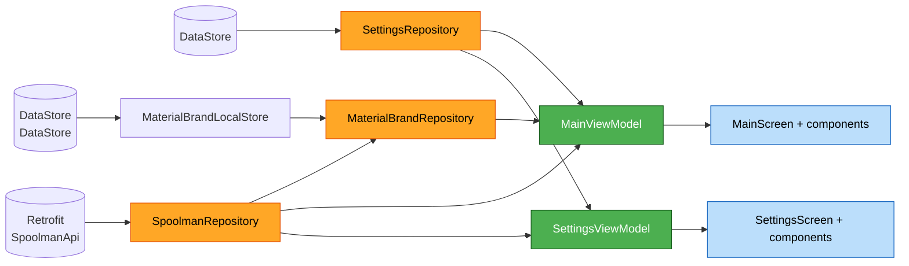
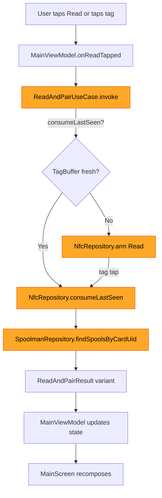
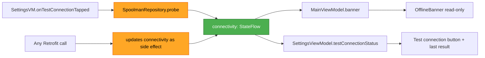

# Component Dependencies — SpoolPainter v2

**Stage**: INCEPTION → Application Design (artifact 4/5)
**Source**: `aidlc-docs/inception/plans/application-design-plan.md` (answered)
**Scope**: Direct dependencies, communication patterns, data flow,
Hilt module grouping. No business logic.

---

## 1. Layered dependency rules (NFR-1.1, NFR-1.2)

**Allowed direction**: UI → ViewModel → Use-case → Repository → Data source.

**Forbidden**:

- UI components calling repositories or data sources directly.
- ViewModels calling data sources directly (must go through repository).
- Repositories depending on ViewModels (no upward dependency).
- Use-cases depending on UI types or ViewModels.

---

## 2. Dependency matrix

Reading: row depends on column.

| ↓ depends on → | Activity | UI Composables | VM | Use-case | Repository | Data source | DI module |
|---|---|---|---|---|---|---|---|
| **MainActivity** | — | ✓ MainScreen | — | — | ✓ NfcRepository (lifecycle hooks only) | — | — |
| **MainScreen** | — | ✓ child Composables | ✓ MainViewModel | — | — | — | — |
| **SettingsScreen** | — | ✓ child Composables | ✓ SettingsViewModel | — | — | — | — |
| **Bottom-sheet Composables** | — | — | ✓ sheet VM | — | — | — | — |
| **MainViewModel** | — | — | — | ✓ all use-cases | ✓ Nfc, Spoolman, MaterialBrand | — | — |
| **SettingsViewModel** | — | — | — | — | ✓ Settings, Spoolman | — | — |
| **Sheet ViewModels** | — | — | — | — | ✓ as needed | — | — |
| **Use-cases** | — | — | — | — | ✓ Nfc, Spoolman | — | — |
| **NfcRepository** | — | — | — | — | — | ✓ NfcAdapterWrapper, OpenSpoolPayloadParser | — |
| **SpoolmanRepository** | — | — | — | — | ✓ SettingsRepository | ✓ SpoolmanApi (Retrofit), CardUidEncoding | — |
| **SettingsRepository** | — | — | — | — | — | ✓ DataStore<Settings> | — |
| **MaterialBrandRepository** | — | — | — | — | ✓ SpoolmanRepository | ✓ MaterialPresetSource, BrandPresetSource, MaterialBrandLocalStore | — |

`MainActivity` depends on `NfcRepository` *only* for `attach()` /
`detach()` lifecycle hooks (Q-CD4=A). No other NFC knowledge in the
Activity.

---

## 3. Communication patterns

### 3.1 UI ← VM: state + effects (Q-DP1=A, Q-DP3=C)

```kotlin
// In Composable:
val state by viewModel.state.collectAsStateWithLifecycle()
LaunchedEffect(Unit) {
    viewModel.effects.collect { effect ->
        when (effect) {
            is UiEffect.ShowSnackbar -> snackbarHost.showSnackbar(effect.message)
            is UiEffect.Navigate -> nav.navigate(effect.destination)
        }
    }
}
```

- `state: StateFlow<UiState>` for persistent state (form, banner, NFC).
- `effects: Flow<UiEffect>` (consumed-once channel) for transient
  snackbars and navigation events.

### 3.2 VM ← User: methods + sealed events (Q-DP2=C)

- **Primary actions** are direct VM method calls: `onReadTapped()`,
  `onWriteTapped()`, `onSpoolSelected(spool)`, etc.
- **Sheet results** flow back through sealed events: `onRepairResult(event)`,
  `onVendorOptInResult(event)`, `onAddCustomMaterialResult(event)`.

### 3.3 VM → Repository: suspend functions returning sealed outcomes (Q-CM2=B)

- Repositories never throw for expected error conditions; they return
  `SpoolmanOutcome<T>` (sealed). Caller pattern-matches.
- Throws are reserved for programmer errors / unexpected states.

### 3.4 Repository → Repository

Two cross-repository links:

- `SpoolmanRepository` → `SettingsRepository` — to read the URL.
  Implemented as `StateFlow<String?>` collection inside
  `SpoolmanRepository.init`.
- `MaterialBrandRepository` → `SpoolmanRepository` — to read the
  vendor list and merge with presets and user-added entries.

### 3.5 Repository → Hardware: lifecycle-bound foreground dispatch (Q-CD4=A)

```kotlin
// MainActivity
override fun onResume() { super.onResume(); nfcRepository.attach(this) }
override fun onPause() { super.onPause(); nfcRepository.detach() }
```

`NfcRepository` holds the Activity reference only between `attach()`
and `detach()`; cleared on `detach()` (no leak).

---

## 4. Data flow diagrams

### 4.1 Steady state (form rendering, dropdown population)



### 4.2 Read-and-Pair (FR-3) — flow with explicit state transitions



### 4.3 Connectivity propagation (Q-CD1=A, Q-CD1.1=A)



URL empty → connectivity = `Unknown` → banner = `Hidden`. URL set + last
call failed → connectivity = `Unreachable` → banner = `Offline`. URL set
+ last call succeeded → connectivity = `Reachable` → banner = `Hidden`.

---

## 5. Hilt module grouping (NFR-2, Q-CD3=B)

Per-layer modules — one per major dependency family. Module choice
matches the execution-plan unit split.

### 5.1 NetworkModule

```kotlin
@Module
@InstallIn(SingletonComponent::class)
object NetworkModule {
    @Provides @Singleton
    fun provideOkHttpClient(): OkHttpClient = ...

    @Provides @Singleton
    fun provideRetrofit(client: OkHttpClient, settings: SettingsRepository): Retrofit = ...

    @Provides @Singleton
    fun provideSpoolmanApi(retrofit: Retrofit): SpoolmanApi = retrofit.create()

    @Provides @Singleton
    fun provideSpoolmanRepository(api: SpoolmanApi, settings: SettingsRepository): SpoolmanRepository = SpoolmanRepository(api, settings)
}
```

### 5.2 RepositoryModule

```kotlin
@Module
@InstallIn(SingletonComponent::class)
object RepositoryModule {
    @Provides @Singleton
    fun provideMaterialBrandRepository(
        materialPresets: MaterialPresetSource,
        brandPresets: BrandPresetSource,
        userStore: MaterialBrandLocalStore,
        spoolman: SpoolmanRepository,
    ): MaterialBrandRepository = MaterialBrandRepository(materialPresets, brandPresets, userStore, spoolman)
}
// SettingsRepository is `@Inject constructor`, no @Provides needed.
// SpoolmanRepository lives in NetworkModule (its dependencies are
// network-shaped).
```

### 5.3 DataStoreModule

```kotlin
@Module
@InstallIn(SingletonComponent::class)
object DataStoreModule {
    @Provides @Singleton
    fun provideSettingsDataStore(@ApplicationContext ctx: Context): DataStore<Settings> = ...

    @Provides @Singleton
    fun provideCustomMaterialsDataStore(@ApplicationContext ctx: Context): DataStore<CustomMaterials> = ...

    @Provides @Singleton
    fun provideCustomBrandsDataStore(@ApplicationContext ctx: Context): DataStore<CustomBrands> = ...
}
```

### 5.4 NfcModule

```kotlin
@Module
@InstallIn(SingletonComponent::class)
object NfcModule {
    @Provides @Singleton
    fun provideNfcAdapterWrapper(@ApplicationContext ctx: Context): NfcAdapterWrapper = ...

    @Provides @Singleton
    fun provideOpenSpoolPayloadParser(): OpenSpoolPayloadParser = OpenSpoolPayloadParser()

    @Provides @Singleton
    fun provideNfcRepository(adapter: NfcAdapterWrapper, parser: OpenSpoolPayloadParser): NfcRepository = NfcRepository(adapter, parser)
}
```

ViewModels are wired by Hilt automatically via `@HiltViewModel`. Use-cases
are `@Inject constructor` (no module needed).

---

## 6. Lifecycle scopes

| Lifetime | Components |
|---|---|
| **Application (`@Singleton`)** | All repositories, all data sources, all `@Inject` use-cases, OkHttp/Retrofit |
| **`@HiltViewModel`** | `MainViewModel`, `SettingsViewModel`, all sheet VMs (one instance per VM scope) |
| **Activity** | `MainActivity` only |
| **Tied to MainActivity onResume/onPause window** | The Activity reference held inside `NfcRepository` between `attach()` and `detach()` — released on `detach()` |

Configuration changes: `viewModelScope` survives, `Singleton`s survive,
`MainActivity` is recreated → calls `nfcRepository.attach(this)` again
in its new `onResume`. The previous `detach()` already cleared the old
reference — no leak.

---

## 7. Forbidden / red-flag patterns

- ❌ **A Composable injecting a repository** (would bypass VM). Compile-time
  enforced — Composables don't have `@Inject` constructors.
- ❌ **A repository holding a long-lived `Activity` reference** outside the
  `attach()` / `detach()` window. Code-review enforced; lint rule
  optional.
- ❌ **A use-case depending on a ViewModel.** Layer violation.
- ❌ **`Dispatchers.IO`** anywhere outside repositories (Q-DP4=A).
- ❌ **Direct call to `SpoolmanApi`** outside `SpoolmanRepository` (NFR-1.2).
