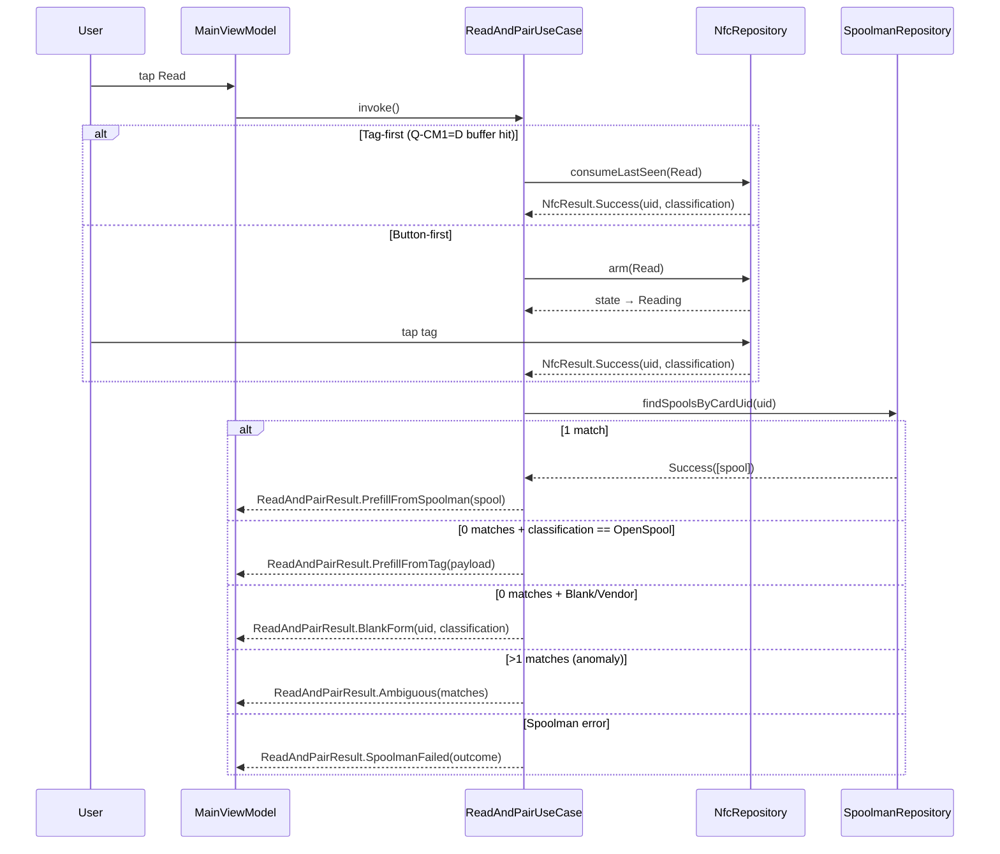
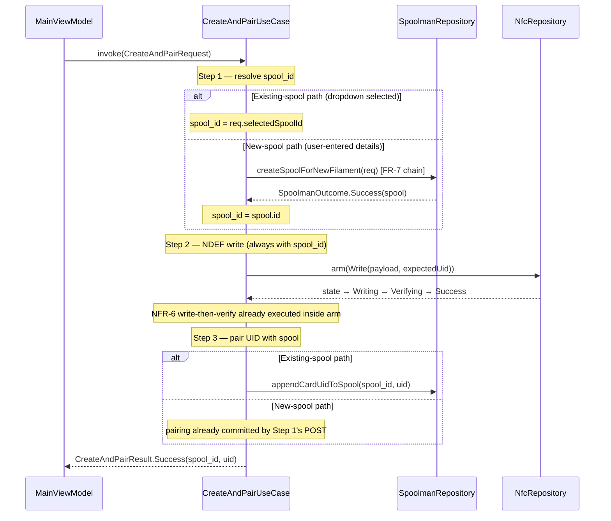
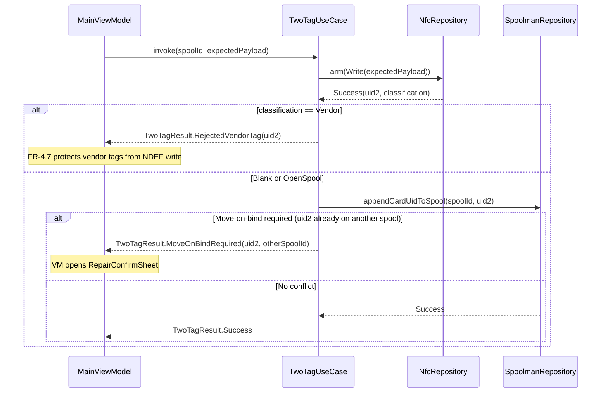
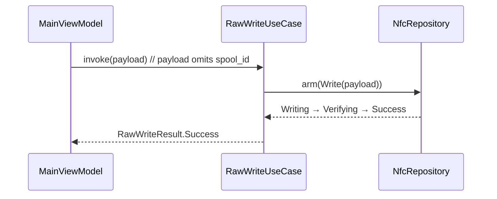
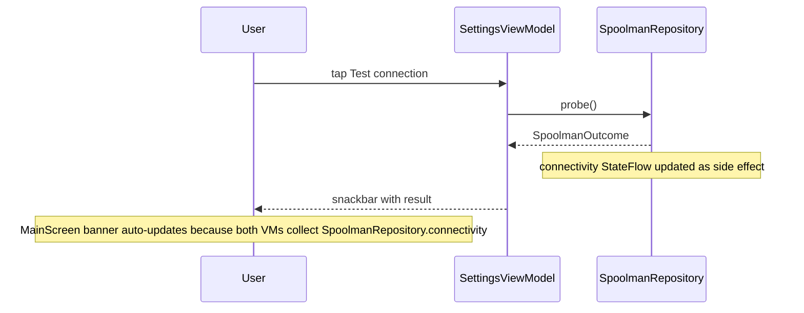

# Services & Orchestration — SpoolPainter v2

**Stage**: INCEPTION → Application Design (artifact 3/5)
**Source**: `aidlc-docs/inception/plans/application-design-plan.md` (answered)
**Scope**: How multi-step flows compose. No business-rule detail —
that's Functional Design (per-unit, CONSTRUCTION phase).

> **Convention**: "Service" in this document = use-case. Q-S1=B chose
> use-cases for multi-step flows only; single-call repository methods
> are not wrapped.

---

## 1. Use-case map

| Use-case | Triggers | Source FRs | Composes |
|---|---|---|---|
| `ReadAndPairUseCase` | `MainScreen` Read button | FR-3 | `NfcRepository.arm(Read)` + `SpoolmanRepository.findSpoolsByCardUid` + form-prefill rules |
| `CreateAndPairUseCase` | `MainScreen` Write button on blank/OpenSpool tag | FR-4 + FR-7 | `SpoolmanRepository.createSpoolForNewFilament` (Q-S2=A) → `NfcRepository.arm(Write)` → verify (NFR-6) → optional `appendCardUidToSpool` |
| `MoveOnBindUseCase` | UID found on another spool during pair | FR-5 | Two `SpoolmanRepository` PATCHes (remove + append) sequenced inside the use-case (Q-S3=C) |
| `TwoTagUseCase` | "Pair another tag" button | FR-6 | `NfcRepository.arm(Write)` (second tag) + `SpoolmanRepository.appendCardUidToSpool` |
| `VendorUidOnlyPairUseCase` | Vendor tag classified + user opts in | FR-4.9 | Same as `CreateAndPairUseCase` minus NDEF write |
| `RawWriteUseCase` | "Raw write" side mode | FR-4.8 | `NfcRepository.arm(Write)` only — no Spoolman side effects |

---

## 2. Read-and-Pair flow (FR-3)



**Banner suppression rule (Q-CD1.1=A)**: Spoolman calls only fire when
the URL is configured. If URL is empty, `findSpoolsByCardUid` is
short-circuited and `ReadAndPairResult.BlankForm` is returned with the
tag's payload (if OpenSpool) — no banner activity, no error.

---

## 3. Create-and-Pair flow (FR-4 + FR-7)

The **Spoolman-first** sequencing rule (FR-4.3) means the new-spool
path runs the FR-7 chain *before* the NDEF write, so `spool_id` is
always available for the payload.



**Recovery rules** (per FR-4.5):
- **Spoolman create fails (Step 1, new-spool path)** → no NDEF write,
  no Spoolman side effects to clean up. User retries.
- **NDEF write fails (Step 2)** → for new-spool path, the Spoolman
  record from Step 1 *remains* (FR-4.5). On retry, Step 1 short-circuits
  via the `findSpoolsByCardUid` lookup (the just-created spool is found
  by its `lot_nr=card_uid:<uid>`) and the existing-spool path runs.
- **Verify mismatch** → surface `CreateAndPairResult.VerifyMismatch`;
  same recovery as above.
- **PATCH fails (Step 3, existing-spool path)** → surface
  `CreateAndPairResult.SpoolmanFailed`; user retries.

---

## 4. Move-on-bind flow (FR-5, Q-S3=C)

Use-case-owned two-PATCH sequence. Use-case (not repository) is the
right home because it composes two repository calls and surfaces
partial-failure semantics distinctly.

```mermaid
sequenceDiagram
    participant V as MainViewModel
    participant UC as MoveOnBindUseCase
    participant S as SpoolmanRepository

    V->>UC: invoke(uid, fromSpoolId, toSpoolId)
    UC->>S: removeCardUidFromSpool(fromSpoolId, uid)
    alt Remove failed
        S-->>UC: HttpError / NetworkError
        UC-->>V: MoveOnBindResult.RemoveFailed(outcome)
    else Remove succeeded
        S-->>UC: Success
        UC->>S: appendCardUidToSpool(toSpoolId, uid)
        alt Append failed
            S-->>UC: HttpError / NetworkError
            UC-->>V: MoveOnBindResult.AppendFailedAfterRemove(outcome)
            Note over UC: Partial-commit: UID is now on neither spool. User must retry; UI surfaces this clearly per FR-5.2.
        else Both succeeded
            S-->>UC: Success
            UC-->>V: MoveOnBindResult.Success
        end
    end
```

**Q11=A — no silent partial commits.** The "AppendFailedAfterRemove"
state is surfaced explicitly so the user knows the original spool no
longer claims the UID. Recovery: tap retry; `appendCardUidToSpool` is
idempotent if the UID is already present.

---

## 5. Two-tag flow (FR-6)

After a successful first pairing, the user can opt to pair a second
physical tag with the same Spoolman spool. Both tags carry identical
NDEF payloads at end state.



**Interrupted state (FR-6.4)**: not persisted. User scans the second
tag at any later point; FR-3 finds the spool by UID and FR-6.1 again
offers to pair another tag.

---

## 6. Vendor UID-only pair flow (FR-4.9)

Triggered when the user presses Write/Save with a vendor-classified tag
staged. UI presents the opt-in bottom sheet first.

```mermaid
sequenceDiagram
    participant U as User
    participant V as MainViewModel
    participant Sheet as VendorUidOnlyOptInSheet
    participant UC as VendorUidOnlyPairUseCase
    participant S as SpoolmanRepository

    U->>V: tap Write (vendor tag staged)
    V->>Sheet: open with copy "This tag is encoded and we can't read its contents — but we can still map its UID..."
    alt User taps Cancel
        Sheet-->>V: VendorOptInResult.Cancelled
        Note over V: form state preserved; no Spoolman calls
    else User taps "Pair UID only"
        Sheet-->>V: VendorOptInResult.Confirmed
        V->>UC: invoke(req)
        Note over UC: branches on existing-spool vs new-spool path same as Step 1 of CreateAndPair, but without Step 2 (NDEF write)
        alt Existing-spool path
            UC->>S: appendCardUidToSpool(selectedSpoolId, uid)
        else New-spool path
            UC->>S: createSpoolForNewFilament(req)
        end
        S-->>UC: outcome
        UC-->>V: VendorUidOnlyResult.Success / SpoolmanFailed
    end
```

Move-on-bind still applies if the vendor tag's UID is already paired
to another spool.

---

## 7. Raw-write flow (FR-4.8)

Used when Spoolman is intentionally not used. NDEF payload omits
`spool_id`. No Spoolman side effects.



FR-4.7 still applies — vendor tags are never written.

---

## 8. Connectivity / Settings refresh (Q-CD1.1=A)

Refresh / Test-connection lives in `SettingsScreen` only. Banner on
`MainScreen` is passive (read-only).



When URL is empty: `probe()` returns immediately as
`SpoolmanOutcome.NetworkError` with `cause = UrlNotConfigured`;
connectivity transitions to `Unknown` (not `Unreachable`); banner stays
hidden.

---

## 9. Use-case reuse / boundaries

- `MoveOnBindUseCase` is invoked **inside** `CreateAndPairUseCase` and
  `TwoTagUseCase` whenever a UID-collision is detected during pair.
  This composition lives in the calling use-case, not in the
  repository.
- `CreateAndPairUseCase` and `VendorUidOnlyPairUseCase` share the same
  Spoolman-first sequencing rule (FR-4.3); the difference is only the
  presence/absence of the NDEF write step. Implementation may share
  a private helper (`pairWithSpoolman(...)`) or duplicate — Functional
  Design call.
