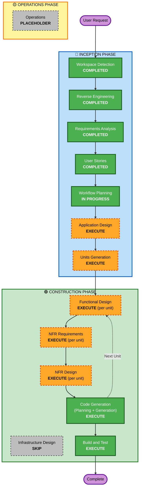

# Execution Plan — SpoolPainter v2

**Source**:
- Requirements: `aidlc-docs/inception/requirements[execution-plan-flowchart.mmd](execution-plan-flowchart.mmd)/requirements.md`
- Stories: `aidlc-docs/inception/user-stories/stories.md`
- Personas: `aidlc-docs/inception/user-stories/personas.md`
- Reverse engineering: `aidlc-docs/inception/reverse-engineering/`

**Project type**: Brownfield rewrite of an existing single-module Android app.
**Release strategy**: Two release waves — **v2.0** (behavioural pivot + arch
overhaul + OpenSpool-only reads) and **v2.1** (multi-vendor decode + key
UI + GPL-3.0 transition). Same package id `com.spoolpainter.app`,
in-place update, no data migration.

**Play Store track strategy**:
- **v1.x stays on the production/public track** (currently versionCode 8,
  versionName 1.7) and is not modified by this workflow.
- **All v2 builds ship to a Play Store testing track first**
  (closed/internal/open — TBD by user) for an extended period before any
  promotion to production. v2 is *not* promoted to the production track
  inside the AIDLC workflow; that gate is owned by the user post-Build &
  Test.
- **Side-by-side dev install**: `debug` build variant
  (`com.spoolpainter.app.debug`) remains the day-to-day install for
  development; the testing-track release is the production package id
  (`com.spoolpainter.app`) signed with the release keystore.
- **versionCode policy**: every v2 testing-track upload bumps `versionCode`
  monotonically above the current production value (≥ 9). v2.0 starts at a
  comfortable gap (e.g., 100) so v1.x patch releases on the production
  track remain feasible without colliding.
- **Rollback**: if a testing-track v2 build is unhealthy, halt promotion;
  testers can uninstall + reinstall v1.7 from the production track. No
  schema rollback required (data lives on tags + Spoolman).

---

## Detailed Analysis Summary

### Transformation Scope (Brownfield)

- **Transformation type**: Architectural overhaul **+** behavioural pivot
  (UID-keyed mapping replaces OpenSpool-payload-as-source-of-truth).
- **Primary changes**:
  - Layered architecture: UI → ViewModel (per-screen) → Repository → data
    source (NFC / Spoolman / Settings).
  - New explicit NFC sealed state model (`Idle | Reading | Writing |
    Verifying | Success | Error`) replacing v1's two-boolean state
    machine.
  - New flows: read-and-pair, create-and-pair, two-tag-per-spool,
    move-on-bind re-pair, raw-write side mode, vendor-tag UID-only pair
    (opt-in).
  - Spoolman client gains: vendor / filament / spool create chain;
    `lot_nr` UID parse + serialise utilities; UID-substring lookup
    (`GET /api/v1/spool?lot_nr=card_uid:<uid>`); PATCH for move-on-bind;
    error surfacing per NFR-7.1.
  - Persistence: `SharedPreferences` → Jetpack DataStore; possibly Room
    for user-added materials/brands (deferred to design — OD-2).
  - DI: introduce **Hilt**.
  - v2.1: vendor-format parsers (Bambu / Creality / Anycubic / Elegoo /
    Qidi / Snapmaker / OpenSpool / TigerTag) ported from OpenRFID under
    GPL-3.0; per-vendor key Settings with Keystore-backed encryption.
- **Related components** (within the single Gradle module):
  - `ui/`: split `MainViewModel` per-screen; new bottom-sheet flows
    (FR-13.2); banner pattern (FR-10.2); custom-entry pickers (FR-8.5).
  - `data/`: new `SpoolmanRepository`, `NfcRepository`,
    `SettingsRepository`. `SpoolmanService` extended with vendor /
    filament / spool create endpoints, `lot_nr`-filtered list, PATCH.
  - `hardware/nfc/`: refactor to Repository + sealed `NfcResult`.
  - `domain/models/`: new types — `CardUid` (canonical hex), `LotNr`
    (parser/serialiser), tag-classification result.

### Change Impact Assessment

| Impact area | Affected? | Description |
|---|---|---|
| User-facing changes | **Yes** | Major UX shift: read becomes pair-aware, write becomes Spoolman-first, two-tag flow, vendor-tag opt-in pair, raw-write side mode, Settings additions, dynamic colour. |
| Structural changes | **Yes** | Per-screen ViewModels + Repository tier + Hilt DI; explicit NFC state model; possible Room. |
| Data model changes | **Yes** (app-side) / **No** (Spoolman-side) | Domain models gain `CardUid`/`LotNr` types; Spoolman field schema is unchanged — `card_uid:<hex>` lives inside existing `lot_nr`. |
| API changes | **Yes** | New Spoolman client surface (vendor/filament/spool POST chain, UID-substring GET, lot_nr PATCH); no Spoolman *server* change required. |
| NFR impact | **Yes** | Architecture overhaul, new persistence stack, NFC reliability rule, error-surfacing rule, encrypted vendor-key storage (v2.1). |
| Infrastructure | **No** | Pure mobile app. No CDK / Terraform / CloudFormation. `usesCleartextTraffic` unchanged. |
| Distribution | **No code-path change** | sideload + Play Store, same as v1; signing key reused. |

### Component Relationships

- **Primary component**: `:app` module (single Gradle module).
- **Infrastructure components**: none.
- **Shared components**: none (single module).
- **Dependent components**: none (no other modules depend on this).
- **Supporting components**: none externally; internal supporting code is
  the existing test scaffold (`app/src/test`, `app/src/androidTest`),
  currently empty — v2 introduces unit tests per NFR-4.1.

### Risk Assessment

- **Risk Level**: **Medium**.
  - Major architectural overhaul (Hilt + repositories + per-screen VMs +
    DataStore + sealed NFC state) on top of behavioural pivot.
  - In-place update of an existing Play Store app (`com.spoolpainter.app`,
    versionCode 8) — bad release affects production users.
  - **Mitigators**: data lives on tags + Spoolman, not in-app — no
    migration risk; `debug` build variant (`com.spoolpainter.app.debug`)
    permits side-by-side testing; `lot_nr` storage choice is forward
    compatible (FR-2.4 migration plan deferred until upstream Spoolman
    PR #773 / issue #716 lands); two-wave release (v2.0, v2.1) limits
    the v2.1 GPL-3.0 + parser-port blast radius.
- **Rollback complexity**: **Easy**. v1.7 APK is signed and shippable;
  user data is on tags + Spoolman. Reverting is "republish v1.7"; no
  schema rollback required.
- **Testing complexity**: **Moderate**. Pure unit tests cover the bulk
  of logic (NFR-4.1: OpenSpool encode/decode, `lot_nr` parsing, UID
  canonicalisation, Spoolman client). NFC + Compose UI tests are
  out-of-scope for v2's minimum bar (NFR-4.2). Manual NFC verification
  required for write/verify and two-tag flows.

### Module Update Strategy

Single Gradle module — **no inter-module coordination needed**.

---

## Workflow Visualization

---

## Phases to Execute

### 🔵 INCEPTION PHASE

- [x] Workspace Detection (COMPLETED — 2026-05-23)
- [x] Reverse Engineering (COMPLETED — 2026-05-23, artifacts under
  `aidlc-docs/inception/reverse-engineering/`)
- [x] Requirements Analysis (COMPLETED — 2026-05-23, comprehensive depth)
- [x] User Stories (COMPLETED — 2026-05-23, 37 stories: 32 v2.0 + 5 v2.1)
- [x] Workflow Planning (IN PROGRESS)
- [ ] **Application Design — EXECUTE**
  - **Rationale**: New components (`SpoolmanRepository`, `NfcRepository`,
    `SettingsRepository`, per-screen ViewModels), new business rules
    (UID canonicalisation, `lot_nr` parse/serialise, tag classification,
    move-on-bind), new service-layer surface on the Spoolman client.
    NFR-1 / NFR-2 are explicit architectural mandates that need
    component-level design before Units Generation can decompose work.
- [ ] **Units Generation — EXECUTE**
  - **Rationale**: 37 stories spread across multiple feature areas (NFC,
    Spoolman client, repositories + DI, persistence, UI shell &
    bottom-sheet flows, settings, theming, vendor decode). Two release
    waves give a natural top-level cut (v2.0 vs v2.1). Decomposition
    will keep per-unit Construction tractable and let v2.0 ship before
    v2.1 work starts.

### 🟢 CONSTRUCTION PHASE (per unit)

- [ ] **Functional Design — EXECUTE (per unit, where applicable)**
  - **Rationale**: Multiple units carry non-trivial business logic that
    must be locked before code:
    - `lot_nr` parser/serialiser (S-2.1 / S-2.2): tail preservation,
      idempotent round-trip, multi-UID, prefix tolerance.
    - UID canonicalisation (S-1.2): variable-length raw bytes → lowercase
      hex.
    - Move-on-bind two-PATCH semantics with partial-commit error message
      (S-5.2).
    - Spoolman create chain ordering (S-7.x) and Spoolman-first
      sequencing on the new-spool path (S-4.2 → S-4.3 → S-4.4 → S-4.5).
    - Tag classification (blank / OpenSpool / vendor) and the FR-4.7 /
      FR-4.9 branch.
    - Vendor parsers + key-gated decode (v2.1).
- [ ] **NFR Requirements — EXECUTE (per unit, where applicable)**
  - **Rationale**: NFR-1 (layered arch + per-screen VMs), NFR-2 (Hilt),
    NFR-3 (DataStore + maybe Room), NFR-4.1 (unit-test bar), NFR-6
    (write-then-verify), NFR-7.1 (error surfacing), NFR-3.4 (Keystore-
    backed key storage for v2.1) — all need per-unit picks (e.g., is
    Room required for FR-8.5? OD-2). Tech-stack picks (e.g., DataStore
    Preferences vs Proto, EncryptedSharedPreferences vs Tink) are
    deferred to this stage.
- [ ] **NFR Design — EXECUTE (per unit, where applicable)**
  - **Rationale**: Patterns to incorporate per unit:
    - Repository + Hilt module shape; `StateFlow<UiState>` per screen.
    - Sealed `NfcResult` state machine + write-then-verify control flow.
    - Banner + retry pattern for Spoolman-unreachable (FR-10.2 / S-10.2).
    - Bottom-sheet flow framework (FR-13.2 / S-13.2) used by
      re-pair confirmation (S-5.2), two-tag prompt (S-6.1), UID-only
      opt-in (S-4.8).
    - Encrypted key storage (v2.1).
- [ ] **Infrastructure Design — SKIP**
  - **Rationale**: Pure Android client. No CDK / Terraform / CloudFormation
    / cloud resources to map. Distribution (sideload + Play Store) and
    `usesCleartextTraffic` are unchanged from v1 and are platform-level
    behaviours captured in NFR-7.3 / NFR-9.2 — no design artifact would
    add value.
- [ ] **Code Generation — EXECUTE (per unit, ALWAYS)**
  - **Rationale**: Workflow mandate; this is where the rewrite actually
    happens. Part 1 (planning) per unit, Part 2 (generation) per unit;
    each unit ends with code + unit tests merged into `:app`.
- [ ] **Build and Test — EXECUTE (ALWAYS)**
  - **Rationale**: Build instructions (Gradle: `./gradlew :app:assembleDebug`,
    `:app:assembleRelease`); unit-test runner (`:app:testDebugUnitTest`)
    once tests exist; manual NFC verification plan; a per-release
    checklist for v2.0 then v2.1.

### 🟡 OPERATIONS PHASE

- [ ] Operations — **PLACEHOLDER**
  - **Rationale**: Future deployment + monitoring expansion. For a
    Play-Store-distributed Android app, the AIDLC operations placeholder
    isn't load-bearing today.

---

## Recommended Unit Decomposition (preview — finalised in Units Generation)

The following is an indicative cut for review; final unit naming + scope
is decided in Units Generation. v2.1 units are listed for traceability
but their Construction loop **starts only after v2.0 ships**.

### v2.0 units

1. **U1 — Architecture & DI scaffold**
   - Hilt setup; `:app`-scoped modules; per-screen ViewModels skeleton;
     `StateFlow<UiState>` pattern; DataStore (Preferences) wired for
     settings; sealed `NfcResult` skeleton.
   - Stories: NFR-1 / NFR-2 / NFR-3 / FR-15 (S-15.1).
2. **U2 — Domain primitives**
   - `CardUid` canonicalisation (S-1.2); `LotNr` parser/serialiser
     (S-2.1, S-2.2); domain-model cleanup.
   - Unit tests: NFR-4.1.
3. **U3 — Spoolman client overhaul**
   - Lot-nr-filtered list (S-3.1); vendor / filament / spool create chain
     (S-7.1, S-7.2, S-7.3); PATCH `lot_nr` (S-4.5); error surfacing
     (NFR-7.1); short-lived in-memory cache (NFR-7.2).
   - Unit tests against a fake API: NFR-4.1.
4. **U4 — NFC repository + state**
   - `NfcRepository` over the existing `hardware/nfc/` adapter; sealed
     `NfcResult`; UID extraction (S-1.1); write-then-verify (S-4.4);
     tag classification (blank / OpenSpool / vendor — basis for S-4.6).
5. **U5 — Read-and-Pair flow**
   - S-3.1 / S-3.2 / S-3.3 / S-3.4 / S-3.5 / S-3.6; FR-3.6 dropdown
     prefill; banner + retry (S-10.2).
6. **U6 — Create-and-Pair flow + two-tag flow**
   - S-4.1 / S-4.2 / S-4.3 / S-4.5 (Spoolman-first sequencing always
     emits `spool_id`); S-5.1 / S-5.2 move-on-bind; S-6.1..S-6.4
     two-tag flow.
7. **U7 — Side modes: raw-write + vendor UID-only opt-in**
   - S-4.6 (NDEF-write boundary); S-4.7 (raw-write); S-4.8 (vendor
     UID-only opt-in via bottom sheet).
8. **U8 — Pickers + custom entries**
   - S-8.1 (presets); S-8.2 (vendor merge); S-8.3 / S-8.4 ("Add custom"
     for material + brand) — local persistence (Room iff OD-2 picks
     it).
9. **U9 — Settings + theming**
   - S-9.1 (URL + connectivity probe), S-9.2 (sort), S-9.3 (theme
     override), S-12.1 (dynamic colour + system follow), S-13.1 / S-13.2
     UI shell.
10. **U10 — v2.0 release polish**
    - NFR-5 release-build log stripping; manual-NFC verification
      checklist; Play Store release notes; signing dry run.
    - **Testing-track release prep**: bump `versionCode` (start at 100 to
      preserve headroom for v1.x patches on production track), set
      `versionName` to `2.0`, build signed release APK/AAB with the local
      keystore (`~/spoolpainter-release-key.jks`), upload to the chosen
      Play Store testing track (closed/internal/open — TBD), draft
      tester-facing release notes covering the behavioural pivot
      (UID-keyed mapping, two-tag flow, vendor-tag UID-only opt-in,
      raw-write side mode). **No promotion to production track in this
      workflow** — that is a user-owned post-Build-&-Test gate.

### v2.1 units (deferred — starts after v2.0 ships)

11. **U11 — Vendor decode engine + GPL-3.0 transition** (S-1.4, S-NFR12,
    S-NFR11): port OpenRFID parsers (Bambu / Creality / Anycubic /
    Elegoo / Qidi / Snapmaker / OpenSpool / TigerTag) to Kotlin;
    re-licence project; baked vendor data (NFR-12).
12. **U12 — Vendor key Settings + encrypted storage** (S-9.4.1, S-9.4.2,
    NFR-3.4): per-vendor key list with Keystore-backed encryption;
    UID-only fallback when keys missing.

---

## Module Update Sequence

Single Gradle module (`:app`) — no cross-module sequencing.

The **logical** unit order (U1 → U10 within v2.0; then U11 → U12 in
v2.1) is the recommended dependency order — each later unit builds on
the earlier scaffolding (e.g., U5/U6 require U2 + U3 + U4). Final
ordering is locked in Units Generation.

---

## Estimated Timeline

- **Total stages**: 10 (5 Inception completed; 2 Inception remaining;
  3 Construction recurring per unit + 1 always + 1 final = 5
  Construction stages; 1 Operations placeholder).
- **Estimated duration**: solo developer effort.
  - **v2.0** — ~3–4 weeks of focused work for U1..U10 (architecture
    overhaul + 6 user-facing flows + tests).
  - **v2.1** — ~2–3 weeks (parser ports, key UI, GPL-3.0 transition).
  - Estimates assume manual NFC testing only (NFR-4.2 — Compose UI +
    instrumented NFC tests out of scope).

---

## Success Criteria

- **Primary goal**: Ship v2.0 to a Play Store **testing track** as
  `com.spoolpainter.app` (versionName 2.0) delivering the FR-1..FR-15
  v2.0 surface area with NFR-1..NFR-10 honoured. v1.x remains on the
  production track unchanged. Promotion of v2 from testing track to
  production is an explicit post-AIDLC gate owned by the user. Ship v2.1
  as a follow-on testing-track release adding multi-vendor decode + key
  Settings under GPL-3.0.
- **Key deliverables**:
  - All 32 v2.0 user stories satisfied; coverage map in `stories.md`
    has no v2.0 gaps.
  - Layered MVVM (UI → VM → Repository → data source) with Hilt; sealed
    `NfcResult`; DataStore-backed settings.
  - Spoolman client extended for vendor / filament / spool POST chain,
    `lot_nr`-filtered GET, and `lot_nr` PATCH — all error-surfacing
    per NFR-7.1.
  - Unit tests per NFR-4.1 on JUnit 4 (existing test stack).
  - Release-mode log strip (NFR-5) and write-then-verify (NFR-6) wired.
  - For v2.1: 5 v2.1 user stories satisfied; encrypted vendor-key store
    via Keystore (NFR-3.4); GPL-3.0 licence + source offer (NFR-11);
    baked vendor data (NFR-12).
- **Quality gates**:
  - All required AIDLC stage approvals captured in `audit.md`.
  - `:app:assembleDebug` + `:app:assembleRelease` succeed; release APK
    signed with the local keystore (`~/spoolpainter-release-key.jks`).
  - `:app:testDebugUnitTest` passes (DoD per stories.md = code merged +
    unit tests passing per NFR-4.1).
  - Manual NFC verification: read-and-pair, create-and-pair, two-tag,
    move-on-bind, raw-write, vendor-tag UID-only opt-in (all v2.0
    happy-paths + named non-happy paths).
  - **Testing-track upload**: signed release artifact uploaded to the
    chosen Play Store testing track; release notes drafted; production
    track untouched.
  - For v2.1: vendor decode round-trip on at least one tag per
    supported vendor where keys are available.

[Brownfield only — applies here]
- **Integration testing**: Read/Write flows integrated end-to-end against
  a self-hosted Spoolman dev instance.
- **Operational readiness**: Release-mode log strip honoured; signing
  config validated; no `usesCleartextTraffic` regressions.
