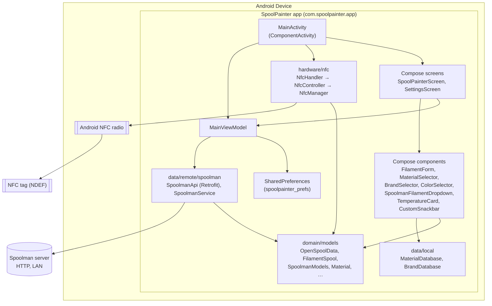
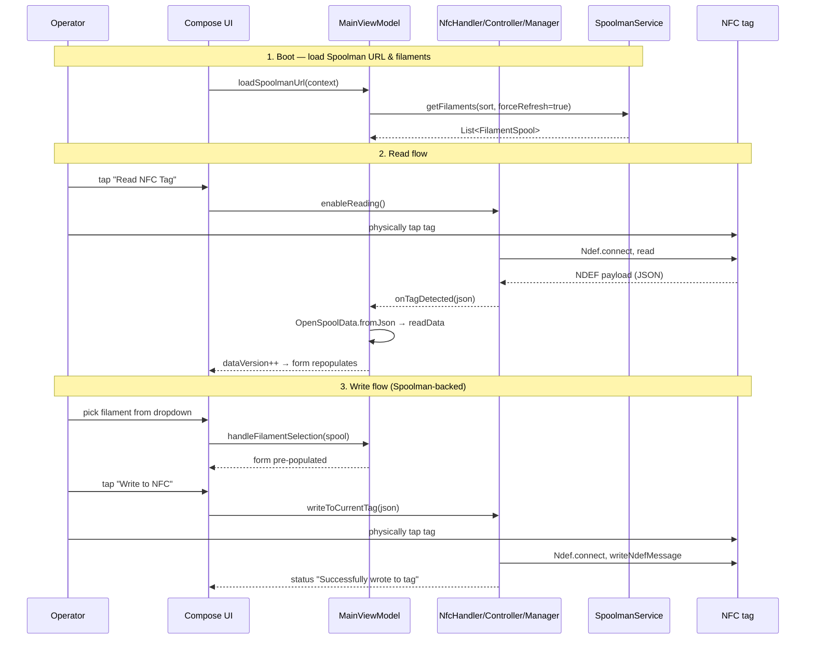

# System Architecture

## System Overview

SpoolPainter v1.x is a single-Activity Android app written in Kotlin with Jetpack
Compose and a light MVVM split. There is one `MainActivity` that owns an
`NfcHandler` (foreground-dispatch lifecycle) and a `MainViewModel` (Compose state).
The app talks to two external surfaces: the device's NFC radio (read/write NDEF
MIME records carrying OpenSpool JSON) and an operator-supplied Spoolman server
(read-only HTTP, typically on the LAN). There is no local persistence beyond
`SharedPreferences` for the Spoolman URL and sort preference.

## Architecture Diagram

## Component Descriptions

### `MainActivity` (`ui/activity/`)
- **Purpose**: Single Activity host; owns NFC dispatch lifecycle.
- **Responsibilities**: install splash, build ViewModel, wire NFC callbacks,
  call `setContent { MainScreenContent(...) }`.
- **Dependencies**: `NfcHandler`, `MainViewModel`, `MainScreenContent`,
  `SpoolPainterTheme`.
- **Type**: Application (UI host).

### `MainViewModel` (`ui/`)
- **Purpose**: Single Compose state holder for the entire screen graph.
- **Responsibilities**: hold read NFC payload, current selected Spool,
  Spoolman URL/sort, snackbar state, settings-visible flag; load/save prefs;
  invoke `SpoolmanService` in `viewModelScope`; merge a freshly-read tag with the
  selected Spool (preserving variant/subtype heuristics).
- **Dependencies**: `SpoolmanService`, `OpenSpoolData`, `FilamentSpool`,
  Android `Context` (for SharedPreferences).
- **Type**: Application.

### Compose screens & components (`ui/screens/`, `ui/components/`)
- **Purpose**: Render the form and settings; collect user input.
- **Responsibilities**: form state (material, variant, color, brand, temps),
  Spoolman dropdown, Settings sheet, snackbar overlay; on Write press, build an
  `OpenSpoolData` and hand its JSON to the NFC layer.
- **Type**: Application.

### `hardware/nfc/`
- **Purpose**: NFC read/write encapsulation.
- **Responsibilities**:
  - `NfcHandler`: thin façade exposed to `MainActivity`.
  - `NfcController`: foreground dispatch, mode (read vs write vs idle), recent-tag
    memory (5s window), lifecycle hooks.
  - `NfcManager`: actual `Ndef` connect/read/write of a single MIME record
    (`application/json`).
- **Dependencies**: `android.nfc.*`.
- **Type**: Application (hardware adapter).

### `domain/models/`
- **Purpose**: Wire & presentation models.
- **Responsibilities**:
  - `OpenSpoolData`: the on-tag JSON; owns `toJson()` / `fromJson()` (uses
    `org.json.JSONObject`); strips a non-JSON language prefix if present;
    falls back to `MaterialDatabase` defaults when temps are missing.
  - `FilamentSpool`: the in-app representation; `fromSpoolman` maps a
    `SpoolmanSpool` (with material-default coercion); `fromOpenSpool` maps a
    tag payload back.
  - `SpoolmanSpool` / `SpoolmanFilament` / `SpoolmanVendor` / `SpoolmanResponse`:
    Spoolman API DTOs (Gson-deserialized).
  - `Material`: temp-range preset.
  - `NfcResult`, `NfcTag`, `AppState`: present but not actively wired in v1.
- **Type**: Model.

### `data/local/`
- **Purpose**: Static in-memory presets.
- **Responsibilities**: `MaterialDatabase` returns `Material` by name (PLA, ABS,
  PETG, TPU, ASA, PC, Nylon, PVA, HIPS, Other); `BrandDatabase` exposes a curated
  brand list.
- **Type**: Local data.

### `data/remote/spoolman/`
- **Purpose**: Spoolman REST client.
- **Responsibilities**:
  - `SpoolmanApi` (Retrofit): `GET api/v1/spool?limit=&offset=&sort=`,
    `GET api/v1/spool/{id}`.
  - `SpoolmanService`: paginates (PAGE_SIZE=10) until empty/short page;
    in-memory 30-second cache; `findFilamentBySpoolId` re-fetches on miss;
    swallows network errors and returns the prior cache or empty list.
- **Dependencies**: Retrofit 2.9.0, OkHttp, Gson.
- **Type**: Remote client.

## Data Flow

## Integration Points

- **External APIs**:
  - Spoolman REST API — `GET /api/v1/spool`, `GET /api/v1/spool/{id}` (HTTP, LAN).
- **Databases**: none. The app holds only in-process state plus `SharedPreferences`.
- **Third-party Services**: none.

## Infrastructure Components

- **CDK Stacks**: n/a (mobile app).
- **Deployment Model**: APK signed with a local keystore (`~/spoolpainter-release-key.jks`,
  password from env `KEYSTORE_PASSWORD` or `~/spoolpainter-keystore.pwd`); sideload
  today, Play Store eventually.
- **Networking**: `usesCleartextTraffic="true"` — Spoolman is typically self-hosted
  HTTP on a LAN.
