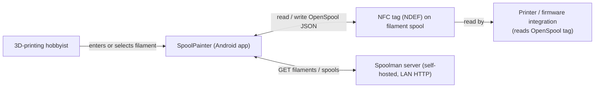

# Business Overview

## Business Context Diagram

## Business Description

- **Business Description**: SpoolPainter is a single-user Android utility for managing
  3D-printer filament metadata. It bridges three pieces of the printing workflow: a
  Spoolman inventory server (the source of truth for which filament is on which spool),
  an OpenSpool-formatted NFC tag stuck on the physical spool (the wire format other
  ecosystem tools — printer firmware, slicers — read), and the operator who needs to
  prepare and identify spools quickly.

- **Business Transactions**:
  1. **Read tag** — operator taps an NFC tag, the app decodes the OpenSpool JSON and
     populates the on-screen form so they can see what the tag claims and (optionally)
     resolve it back to a Spoolman spool.
  2. **Write tag (manual data entry)** — operator fills in material / temps / color /
     brand and writes an OpenSpool JSON record to a blank or re-writable NFC tag.
  3. **Write tag (Spoolman-backed)** — operator picks a filament from the Spoolman
     dropdown; the app pre-fills the form with that spool's metadata, then writes
     the OpenSpool JSON (including the Spoolman `spool_id`) to the tag so the printed
     part can later be traced back to a specific spool in inventory.
  4. **Configure Spoolman** — operator sets the Spoolman server URL and an optional
     sort order in Settings. The app validates the URL by attempting to fetch the
     filament list.
  5. **Refresh inventory** — pull-to-refresh re-fetches the filament list from
     Spoolman, bypassing the in-memory cache.

- **Business Dictionary**:
  - **OpenSpool**: a JSON-on-NDEF wire format describing a filament spool; written to
    NFC tags so any consumer (firmware, slicer, app) can read identical data.
    Field names are snake_case (`color_hex`, `min_temp`, `bed_min_temp`, `spool_id`,
    `lot_nr`, …).
  - **Spool**: a physical filament spool. In Spoolman, it is a record with an `id`,
    associated with a `Filament` (material, color, vendor, recommended temps).
  - **Filament**: in Spoolman, the SKU-level definition (vendor, material, color,
    settings); a Spool instance points at a Filament.
  - **Variant** / **subtype**: free-form sub-classification within a material — e.g.,
    "Wood", "Pro", "HS"; serialized to OpenSpool's `subtype` field.
  - **Tag**: an NFC NTAG-class sticker physically attached to the spool body.

## Component Level Business Descriptions

### `ui/`
- **Purpose**: Operator-facing surface — single Activity, Compose-only.
- **Responsibilities**: Render the filament form, the Spoolman dropdown, settings,
  and snackbar status; turn user input into an OpenSpool record; trigger the NFC
  read/write hand-off.

### `domain/models/`
- **Purpose**: Wire and presentation models for the three data realms (NFC payload,
  Spoolman API, in-app form).
- **Responsibilities**: Own JSON encode/decode for OpenSpool, mapping between
  Spoolman API objects and the in-app `FilamentSpool`, and material defaults
  fallback logic.

### `hardware/nfc/`
- **Purpose**: Encapsulate Android's NFC foreground-dispatch lifecycle.
- **Responsibilities**: Read/write NDEF MIME records (`application/json` payload),
  manage read-vs-write mode, surface status messages to the UI.

### `data/local/`
- **Purpose**: Static presets — material defaults (temp ranges) and brand list.
- **Responsibilities**: Provide sensible defaults so a tag can be written without
  Spoolman, and so a freshly-read tag can be enriched if any temps are missing.

### `data/remote/spoolman/`
- **Purpose**: Spoolman API client.
- **Responsibilities**: Paginate `/api/v1/spool`, lookup by id, cache for 30s,
  map Spoolman objects to `FilamentSpool`.
