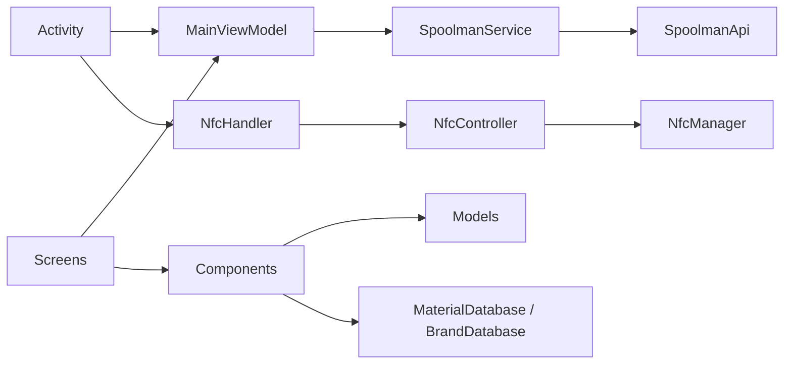

# Code Structure

## Build System
- **Type**: Gradle (Kotlin DSL) with version catalog
- **Configuration**:
  - Root `build.gradle.kts` — plugin declarations
  - `settings.gradle.kts` — single-module include `:app`
  - `gradle/libs.versions.toml` — version catalog (AGP 8.13.2, Kotlin 2.0.21,
    Compose BOM 2024.09.00, lifecycle-runtime-ktx 2.6.1, activity-compose 1.8.0)
  - `app/build.gradle.kts` — `com.android.application`,
    `org.jetbrains.kotlin.android`, `org.jetbrains.kotlin.plugin.compose`;
    `applicationId = "com.spoolpainter.app"`, `minSdk = 29`, `targetSdk = 36`,
    `compileSdk = 36`, `versionCode = 8`, `versionName = "1.7"`
  - Build types: `debug` (suffix `.debug`, name `-DEBUG`) and signed `release`
  - Compose enabled via `buildFeatures { compose = true }`

## Key Modules

### Existing Files Inventory

`app/src/main/`
- `AndroidManifest.xml` — declares NFC permission + required feature, single
  Activity, cleartext traffic enabled
- `java/com/spoolpainter/app/ui/activity/MainActivity.kt` — Activity lifecycle
  + NFC dispatch wiring
- `java/com/spoolpainter/app/ui/MainViewModel.kt` — Compose state holder for
  the whole app
- `java/com/spoolpainter/app/ui/screens/MainScreenContent.kt` — top-level
  switch between SpoolPainterScreen and SettingsScreen
- `java/com/spoolpainter/app/ui/screens/SpoolPainterScreen.kt` — the main form:
  logo, Spoolman dropdown, FilamentForm, TemperatureSection, Read/Write buttons,
  CustomSnackbar overlay, pull-to-refresh
- `java/com/spoolpainter/app/ui/screens/SettingsScreen.kt` — Spoolman URL +
  sort-by dropdown
- `java/com/spoolpainter/app/ui/components/FilamentForm.kt` — Material/Variant/
  Color/Brand fields (delegates to MaterialSelector, ColorSelector, BrandSelector)
- `java/com/spoolpainter/app/ui/components/MaterialSelector.kt` — material
  dropdown sourced from MaterialDatabase
- `java/com/spoolpainter/app/ui/components/BrandSelector.kt` — brand dropdown
  with custom-entry "Other"
- `java/com/spoolpainter/app/ui/components/ColorSelector.kt` — color picker
  (largest UI component at ~686 lines; preset palette + custom hex)
- `java/com/spoolpainter/app/ui/components/SpoolmanFilamentDropdown.kt` —
  ExposedDropdownMenu of fetched filaments; resolves `spool_id` back to a
  Spoolman record via `SpoolmanService.findFilamentBySpoolId`
- `java/com/spoolpainter/app/ui/components/TemperatureCard.kt` —
  TemperatureControl widget (used by TemperatureSection in SpoolPainterScreen)
- `java/com/spoolpainter/app/ui/components/CustomSnackbar.kt` — overlay status
  banner (replaces Material's SnackbarHost)
- `java/com/spoolpainter/app/ui/components/SpoolPainterLogo.kt` — logo with
  tinted "paint" reflecting selected color
- `java/com/spoolpainter/app/ui/components/NfcStatusCard.kt` — status card
  (defined but not currently composed in the active screen — likely dead code)
- `java/com/spoolpainter/app/ui/theme/Theme.kt` — Material 3 theme + colors
- `java/com/spoolpainter/app/hardware/nfc/NfcHandler.kt` — façade over Controller
- `java/com/spoolpainter/app/hardware/nfc/NfcController.kt` — foreground dispatch,
  read/write/idle modes, 5-second recent-tag memory, status callbacks
- `java/com/spoolpainter/app/hardware/nfc/NfcManager.kt` — NDEF connect / read /
  write of a single `application/json` MIME record
- `java/com/spoolpainter/app/domain/models/OpenSpoolData.kt` — wire format
  (`org.json.JSONObject`); `toJson()`, `fromJson()`, `toOpenSpoolData(spool)`,
  `generateLotNr()`
- `java/com/spoolpainter/app/domain/models/FilamentSpool.kt` — in-app spool
  model; `fromSpoolman`, `fromOpenSpool`
- `java/com/spoolpainter/app/domain/models/SpoolmanModels.kt` — DTOs:
  `SpoolmanSpool`, `SpoolmanFilament`, `SpoolmanVendor`, `SpoolmanResponse<T>`
- `java/com/spoolpainter/app/domain/models/Material.kt` — temp-range preset
- `java/com/spoolpainter/app/domain/models/NfcResult.kt` — sealed class (defined,
  not actively used)
- `java/com/spoolpainter/app/domain/models/NfcTag.kt` — data class (defined,
  not actively used)
- `java/com/spoolpainter/app/domain/models/AppState.kt` — data class (defined,
  not actively used)
- `java/com/spoolpainter/app/data/local/MaterialDatabase.kt` — list of 10
  materials with default temps
- `java/com/spoolpainter/app/data/local/BrandDatabase.kt` — list of 12 brand names
- `java/com/spoolpainter/app/data/remote/spoolman/SpoolmanService.kt` — Retrofit
  setup + paginated `getFilaments` + `findFilamentBySpoolId`, in-memory 30s cache

`app/src/test/` — empty
`app/src/androidTest/` — only a stray `.DS_Store`

## Design Patterns

### MVVM (loose)
- **Location**: `MainActivity` ↔ `MainViewModel` ↔ Compose screens
- **Purpose**: separate state from UI rendering
- **Implementation**: ViewModel exposes `mutableStateOf` properties (no
  `StateFlow`); UI passes props down. Local form state is held in screen
  composables, not in the ViewModel — the ViewModel only owns "global"
  state (read payload, selected spool, snackbar, settings flag, prefs).

### Sealed result type (defined but unused)
- `NfcResult { Success | Error | TagDetected | NoTag }` — declared but not
  threaded through; the NFC layer instead surfaces results via two function
  callbacks (`onTagDetected`, `onStatusUpdate`).

### Companion-object factories
- `OpenSpoolData.fromJson` / `toOpenSpoolData(spool)`,
  `FilamentSpool.fromSpoolman` / `fromOpenSpool` — keep mapping concentrated
  on the model side.

## Critical Dependencies

- **Jetpack Compose (BOM 2024.09.00)** — UI
- **Material 3 (`androidx.compose.material3`)** — components
- **Retrofit 2.9.0 + Gson converter** — Spoolman API
- **OkHttp logging-interceptor 4.12.0** — declared, not currently installed
  on the OkHttp client builder
- **AndroidX core-splashscreen 1.0.1** — splash
- **`org.json.JSONObject`** (Android stdlib) — used for OpenSpool encode/decode
  (Gson is **not** used for OpenSpool payloads; only for Spoolman responses)
