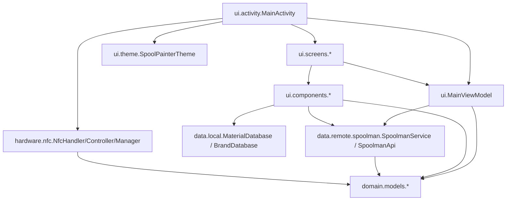

# Dependencies

## Internal Dependencies

### Cross-component edges

- **`Activity` depends on `VM`, `NfcMod`, `Screens`, `Theme`**
  - **Type**: Compile / runtime
  - **Reason**: Activity owns the ViewModel and NFC dispatch; sets Compose content.

- **`VM` depends on `DataRemote`, `Models`**
  - **Type**: Runtime
  - **Reason**: Loads filaments from Spoolman; parses tag JSON.

- **`Screens` depend on `VM`, `Components`, `Models`**
  - **Type**: Compile / runtime
  - **Reason**: Bind ViewModel state to UI; build OpenSpoolData on Write.

- **`Components` depend on `DataLocal`, `Models`, `DataRemote`**
  - **Type**: Compile / runtime
  - **Reason**: MaterialSelector reads `MaterialDatabase`; SpoolmanFilamentDropdown
    calls `SpoolmanService.findFilamentBySpoolId` directly (a v1 layering wart —
    a Compose component reaches across to the network layer rather than going
    through the ViewModel).

- **`NfcMod` depends only on Android `android.nfc.*`** — no app-level deps.

## External Dependencies

### Jetpack Compose (`androidx.compose.*`)
- **Version**: BOM `2024.09.00`
- **Purpose**: declarative UI
- **License**: Apache-2.0

### Material 3 (`androidx.compose.material3`)
- **Version**: from BOM
- **Purpose**: M3 components (Button, Card, OutlinedTextField,
  ExposedDropdownMenu, PullToRefreshBox, …)
- **License**: Apache-2.0

### AndroidX core / activity / lifecycle / appcompat / splashscreen
- **Versions**: as declared above
- **Purpose**: standard AndroidX runtime
- **License**: Apache-2.0

### Retrofit 2 (`com.squareup.retrofit2:retrofit`)
- **Version**: `2.9.0`
- **Purpose**: Spoolman HTTP client
- **License**: Apache-2.0

### Gson Converter (`com.squareup.retrofit2:converter-gson`)
- **Version**: `2.9.0`
- **Purpose**: deserialize Spoolman JSON
- **License**: Apache-2.0

### OkHttp logging-interceptor (`com.squareup.okhttp3:logging-interceptor`)
- **Version**: `4.12.0`
- **Purpose**: HTTP logging — declared but **not currently attached** to the
  OkHttpClient. (Either remove the dep in v2 or wire it in for debug builds.)
- **License**: Apache-2.0

### Material Components legacy (`com.google.android.material:material`)
- **Version**: `1.12.0`
- **Purpose**: theme parents / minor classic-View interop. Likely removable in
  v2 if there are no remaining classic-View usages.
- **License**: Apache-2.0
